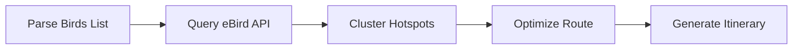
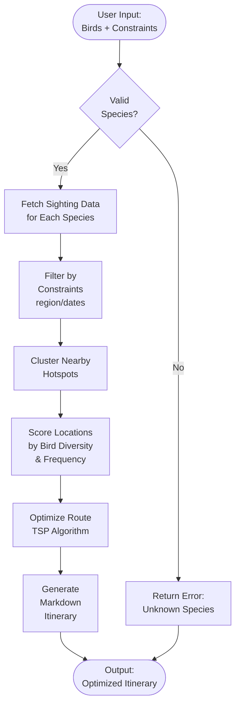
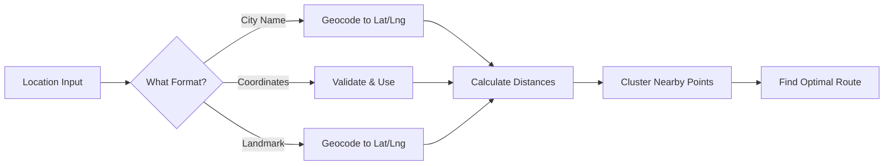

 Great! Now I understand PocketFlow better. Based on the documentation, PocketFlow is a lightweight LLM
  framework perfect for building your birdwatcher travel planning app. Let me help you plan the
  implementation:

  Your Birdwatcher Travel Planner App - PocketFlow Implementation Plan

  Your app specification is excellent and aligns perfectly with PocketFlow's capabilities. Here's how to
  structure it:

  1. App Architecture (Multi-Agent Pattern)

  - Parser Agent: Handle bird species list parsing and eBird taxonomy mapping
  - eBird API Agent: Query eBird API for sightings and hotspot data
  - Optimization Agent: Cluster locations and optimize travel routes
  - Itinerary Agent: Generate the final markdown travel plan

  2. Key Implementation Steps

  Phase 1: Setup & Data Collection
  - Create PocketFlow app structure
  - Integrate eBird API (you'll need an API key)
  - Implement species validation against eBird taxonomy

  Phase 2: Core Logic
  - Build location clustering algorithm based on proximity and bird overlap
  - Implement route optimization (could use graph algorithms or external routing APIs)
  - Add constraint handling (region limits, time constraints, etc.)

  Phase 3: Output Generation
  - Template system for markdown itinerary generation
  - Include eBird hotspot links and metadata
  - Add fallback handling for rare/unseen species

  3. Technical Considerations

  - eBird API Rate Limits: Implement proper throttling
  - Geospatial Math: Calculate distances and optimal routing
  - Error Handling: Graceful degradation when species aren't found
  - Caching: Store recent API results to improve performance

  Would you like me to help you start building this app? I can help you:
  1. Set up the initial PocketFlow app structure
  2. Create the eBird API integration
  3. Build the route optimization logic
  4. Design the output formatting


---

What a fantastic project idea! As a fellow researcher, I love how this combines data analysis with practical application. Let's break this down into PocketFlow concepts and build it step by step.

## 🧬 Project Architecture (Think of it like a Research Pipeline)

Just like how you'd design an experiment workflow, we'll create a data processing pipeline:



## 📋 PocketFlow Design Pattern

For this project, we'll use a **Workflow** pattern (sequential processing) with these components:

### 1. **Nodes** (Individual Processing Steps)
- `ParseBirdsNode`: Clean and validate species names
- `QueryEBirdNode`: Fetch sighting data (BatchNode for multiple species)
- `ClusterHotspotsNode`: Group nearby locations
- `OptimizeRouteNode`: Calculate efficient travel path
- `GenerateItineraryNode`: Format final output

### 2. **Shared Store** (Like a Lab Notebook)
```python
shared = {
    "input": {
        "species_list": ["Northern Cardinal", "Blue Jay"],
        "constraints": {
            "start_location": "Boston, MA",
            "max_days": 5,
            "region": "New England"
        }
    },
    "species_data": {},      # eBird API results
    "hotspots": {},          # Clustered locations
    "route": [],             # Optimized path
    "itinerary": ""          # Final markdown output
}
```

## 🔧 Let's Start Building!

First, let's create the utility function for the eBird API:

```python
# utils/ebird_api.py
import requests
from typing import List, Dict
import os

def get_recent_sightings(species_code: str, region: str = "US", days_back: int = 30):
    """
    Fetch recent bird sightings from eBird API
    
    Think of this like querying a genomics database - 
    we're looking for occurrence data with spatial coordinates
    """
    API_KEY = os.getenv("EBIRD_API_KEY")  # Store your API key safely
    
    base_url = "https://api.ebird.org/v2/data/obs"
    
    # Build the API endpoint (like constructing a database query)
    endpoint = f"{base_url}/{region}/recent/{species_code}"
    
    headers = {"X-eBirdApiToken": API_KEY}
    params = {"back": days_back}
    
    try:
        response = requests.get(endpoint, headers=headers, params=params)
        response.raise_for_status()
        return response.json()
    except Exception as e:
        print(f"Error fetching data for {species_code}: {e}")
        return []

# Test the function
if __name__ == "__main__":
    # Northern Cardinal's eBird code
    sightings = get_recent_sightings("norcar", "US-MA", 7)
    print(f"Found {len(sightings)} recent sightings")
```

Now, let's create our first node:

```python
# nodes.py
from pocketflow import Node, BatchNode
from utils.ebird_api import get_recent_sightings

class ParseBirdsNode(Node):
    """
    Like validating sample IDs before sequencing - 
    we need to ensure species names are correct
    """
    
    def prep(self, shared):
        # Extract the raw species list from shared store
        return shared["input"]["species_list"]
    
    def exec(self, species_list):
        # In a real implementation, we'd map common names to eBird codes
        # For now, let's use a simple mapping
        species_mapping = {
            "Northern Cardinal": "norcar",
            "Blue Jay": "blujay",
            "American Robin": "amerob"
        }
        
        validated_species = []
        for species in species_list:
            if species in species_mapping:
                validated_species.append({
                    "common_name": species,
                    "ebird_code": species_mapping[species]
                })
            else:
                print(f"Warning: {species} not found in database")
        
        return validated_species
    
    def post(self, shared, prep_res, exec_res):
        # Store validated species in shared store
        shared["validated_species"] = exec_res
        return "default"  # Continue to next node
```

## 🤔 Next Steps to Build Together

1. **Create QueryEBirdNode as a BatchNode** - Process multiple species in parallel
2. **Build clustering algorithm** - Group nearby hotspots (think of it like clustering gene expression data)
3. **Implement route optimization** - Could use traveling salesman problem algorithms
4. **Format the output** - Generate beautiful markdown itineraries

Would you like to:
- A) Continue building the QueryEBirdNode together?
- B) See how to handle API rate limits and errors?
- C) Explore the route optimization algorithm?
- D) Start with a simpler version that works for just one bird?

Which aspect interests you most? Remember, in research we often start with a pilot study - same principle applies here! 🦅


---

Great question! No, I don't need direct access to the eBird API - I'll help you build the code that YOU will run on your computer to access it. Think of me as your lab partner who helps design the experiment, but you're the one who runs it on your equipment! 🧪

Here's what we need to do:

## 🔑 Setting Up Your eBird API Access

1. **Get Your API Key** (like getting credentials for a genomics database):
    
    - Go to https://ebird.org/api/keygen
    - Create an account if needed
    - Request an API key (usually instant approval)
    - Save it somewhere secure
2. **Store Your API Key Safely**:
    
    ```bash
    # In your terminal (like setting up lab equipment)
    export EBIRD_API_KEY="your-key-here"
    
    # Or create a .env file in your project
    echo "EBIRD_API_KEY=your-key-here" > .env
    ```
    
3. **Test Your Access**:
    
    ```python
    # Quick test script
    import os
    import requests
    
    API_KEY = os.getenv("EBIRD_API_KEY")
    url = "https://api.ebird.org/v2/ref/taxonomy/ebird"
    headers = {"X-eBirdApiToken": API_KEY}
    
    response = requests.get(url, headers=headers)
    print(f"Status: {response.status_code}")
    if response.status_code == 200:
        print("✅ API key works!")
    ```
    

## 🎯 What I'll Help You With

I'll guide you through:

- Writing the code to query the API
- Handling responses and errors
- Processing the data efficiently
- Building the PocketFlow nodes

You'll run the code and tell me:

- What results you get
- Any errors that occur
- What the data looks like

It's like when you teach someone a lab protocol - I explain the steps, you perform them, and we troubleshoot together!

**Ready to get your API key and start building?** Once you have it set up, we can create a simple test to fetch data for one bird species and see what the API returns. This will help us design our nodes properly! 🦜


---

Yes! I'm familiar with the eBird API structure. Let me show you the key endpoints we'll need for your birding itinerary app - think of these as different "assays" we can run on the bird sighting database:

## 🔬 Key eBird API Endpoints for Our Project

### 1. **Recent Observations by Species**

```python
# Get recent sightings of a specific bird in a region
GET https://api.ebird.org/v2/data/obs/{regionCode}/recent/{speciesCode}

# Example: Northern Cardinal in Massachusetts, last 30 days
endpoint = "https://api.ebird.org/v2/data/obs/US-MA/recent/norcar"
params = {"back": 30}  # days to look back
```

### 2. **Hotspot Information**

```python
# Get details about birding hotspots in a region
GET https://api.ebird.org/v2/ref/hotspot/{regionCode}

# Returns GPS coordinates, hotspot names, etc.
endpoint = "https://api.ebird.org/v2/ref/hotspot/US-MA"
```

### 3. **Historic Observations** (for seasonal patterns)

```python
# Get observations on specific dates (like September migration)
GET https://api.ebird.org/v2/data/obs/{regionCode}/historic/{y}/{m}/{d}

# Example: All birds seen in MA on Sept 15, 2023
endpoint = "https://api.ebird.org/v2/data/obs/US-MA/historic/2023/9/15"
```

### 4. **Species Reference Data**

```python
# Convert common names to eBird species codes
GET https://api.ebird.org/v2/ref/taxonomy/ebird

# Returns the full taxonomy with codes like "norcar" for Northern Cardinal
```

## 📊 Response Data Structure

The API returns JSON data (like getting results from a sequencer):

```python
# Example response for recent sightings
[
    {
        "speciesCode": "norcar",
        "comName": "Northern Cardinal",
        "sciName": "Cardinalis cardinalis",
        "locName": "Fresh Pond, Cambridge",
        "lat": 42.3831,
        "lng": -71.1489,
        "obsDt": "2024-01-15 08:30",
        "howMany": 3,
        "locId": "L109516"  # Hotspot ID
    },
    # ... more sightings
]
```

## 🧪 Let's Build a Complete Test Function

Here's how we'll interact with these endpoints in our PocketFlow nodes:

```python
# utils/ebird_api.py
import requests
from typing import List, Dict, Optional
from datetime import datetime, timedelta
import time

class eBirdAPI:
    """Think of this as our interface to the bird sighting database"""
    
    def __init__(self, api_key: str):
        self.api_key = api_key
        self.base_url = "https://api.ebird.org/v2"
        self.headers = {"X-eBirdApiToken": api_key}
        
    def get_species_code(self, common_name: str) -> Optional[str]:
        """Convert 'Blue Jay' to 'blujay' - like mapping gene names"""
        endpoint = f"{self.base_url}/ref/taxonomy/ebird"
        params = {"fmt": "json", "locale": "en"}
        
        response = requests.get(endpoint, headers=self.headers, params=params)
        if response.status_code == 200:
            taxonomy = response.json()
            for species in taxonomy:
                if species["comName"].lower() == common_name.lower():
                    return species["speciesCode"]
        return None
    
    def get_recent_sightings(self, species_code: str, region: str, days: int = 30):
        """Fetch recent observations - our main data collection method"""
        endpoint = f"{self.base_url}/data/obs/{region}/recent/{species_code}"
        params = {
            "back": days,
            "includeProvisional": True,  # Include unreviewed sightings
            "detail": "full"
        }
        
        response = requests.get(endpoint, headers=self.headers, params=params)
        time.sleep(0.5)  # Be nice to the API (like not overloading a sequencer)
        
        if response.status_code == 200:
            return response.json()
        else:
            print(f"Error {response.status_code}: {response.text}")
            return []
    
    def get_hotspot_info(self, location_id: str):
        """Get detailed info about a birding location"""
        endpoint = f"{self.base_url}/ref/hotspot/info/{location_id}"
        response = requests.get(endpoint, headers=self.headers)
        return response.json() if response.status_code == 200 else None

# Test it out
if __name__ == "__main__":
    api = eBirdAPI("your-key-here")
    
    # Test species lookup
    code = api.get_species_code("Northern Cardinal")
    print(f"Northern Cardinal code: {code}")
    
    # Test recent sightings
    sightings = api.get_recent_sightings(code, "US-MA", 7)
    print(f"Found {len(sightings)} sightings in last week")
```

## 🎯 For Your Birding Itinerary, We'll Need:

1. **Species lookup** → Get correct codes
2. **Recent sightings** → Find where birds were seen
3. **Hotspot details** → Get GPS coordinates for routing
4. **Historic data** → Check seasonal patterns (September migration!)

Want to start by testing one of these endpoints with your API key? We can see what real data looks like and then design our PocketFlow nodes accordingly! 🦅


---

Absolutely right! Let's follow the PocketFlow philosophy properly. As they say: **"If Humans can't specify the flow, AI Agents can't automate it!"**

Let's think through this like designing a research study - we need our hypothesis, methods, and expected outcomes before we start collecting data.

## 📋 Step 1: Requirements (What problem are we solving?)

Let's clarify what our birding itinerary app really needs to do:

### Core Problem Statement

"Given a list of target bird species and travel constraints, generate an optimal route that maximizes observation probability while minimizing travel time."

### Is AI a Good Fit? ✅ YES

- **Routine task**: Querying APIs, processing location data
- **Well-defined inputs**: Bird list, date range, geographic constraints
- **Clear outputs**: Ordered location list with distances
- **Common sense reasoning**: Balance trade-offs between distance and sighting probability

### User Stories (Like Research Questions)

1. "I want to see 5 specific warblers during fall migration in New England"
2. "Plan a weekend trip from Boston to see winter waterfowl"
3. "Find the best spots for photographing raptors within 2 hours of my location"

## 🗺️ Step 2: Flow Design (High-Level Architecture)

Before we code, let's think about the logical flow. I'll draw this out:



### Key Design Decisions

1. **Pattern Choice**: **Workflow** (sequential) with one **MapReduce** section
    
    - Main flow is sequential (validate → fetch → cluster → route → format)
    - Fetching data for multiple species = MapReduce pattern
2. **Where Complexity Lives**:
    
    - **Clustering Algorithm**: How close is "nearby"? (Think like clustering gene expression data)
    - **Scoring Function**: How do we weight frequency vs. distance?
    - **Route Optimization**: Full TSP or greedy algorithm?

## 🧩 Step 3: Node Breakdown (Before We Code!)

Let's define each node's responsibility:

### 1. **ValidateSpeciesNode** (Regular Node)

- **Input**: Raw species names from user
- **Process**: Validate against eBird taxonomy
- **Output**: List of `{common_name, species_code}` or error

### 2. **FetchSightingsNode** (BatchNode - MapReduce!)

- **Input**: Validated species list
- **Process**: Query eBird API for each species
- **Output**: Dictionary of species → sighting locations

### 3. **FilterByConstraintsNode** (Regular Node)

- **Input**: All sightings + user constraints
- **Process**: Apply geographic/temporal filters
- **Output**: Filtered sighting list

### 4. **ClusterHotspotsNode** (Regular Node)

- **Input**: Filtered sightings
- **Process**: Group locations within X km of each other
- **Output**: Clustered hotspots with species lists

### 5. **ScoreLocationsNode** (Regular Node)

- **Input**: Clustered hotspots
- **Process**: Score by diversity + frequency
- **Output**: Ranked location list

### 6. **OptimizeRouteNode** (Regular Node)

- **Input**: Scored locations + start point
- **Process**: Calculate optimal visiting order
- **Output**: Ordered route with distances

### 7. **GenerateItineraryNode** (Regular Node)

- **Input**: Optimized route + all metadata
- **Process**: Format as markdown
- **Output**: Final itinerary string

## 🤔 Critical Design Questions (Before Implementation!)

1. **Clustering Distance**: What's "nearby"? 5km? 10km?
2. **Time Windows**: Recent only, or historical patterns?
3. **Scoring Weights**: Prioritize rare birds or total species count?
4. **Route Constraints**: Max daily driving time?
5. **API Limits**: How to handle rate limiting?

## 📊 Shared Store Schema Design

```python
shared = {
    # User inputs
    "input": {
        "species_list": ["Wood Duck", "Hooded Merganser"],
        "constraints": {
            "start_location": {"lat": 42.3601, "lng": -71.0589},  # Boston
            "max_days": 3,
            "max_daily_distance_km": 200,
            "date_range": {"start": "2024-09-01", "end": "2024-09-30"},
            "region": "US-MA"
        }
    },
    
    # Processing stages
    "validated_species": [],      # With eBird codes
    "all_sightings": {},         # Raw API responses
    "filtered_sightings": [],    # After constraints applied
    "hotspot_clusters": [],      # Grouped locations
    "scored_locations": [],      # With ranking scores
    "optimized_route": [],       # Final order with distances
    
    # Output
    "itinerary_markdown": "",
    
    # Metadata for debugging
    "processing_stats": {
        "total_sightings_fetched": 0,
        "sightings_after_filter": 0,
        "clusters_formed": 0,
        "total_route_distance_km": 0
    }
}
```

## 🎯 What Do You Think?

Before we write ANY code, let's validate this design:

1. **Does the flow make sense for your use case?**
2. **What clustering distance feels right? (5km = 3 miles)**
3. **Should we prioritize rare birds or total species variety?**
4. **Any constraints I'm missing?**

Once we nail down the design, THEN we'll implement - and the coding will be much easier because we know exactly what we're building!

This is the PocketFlow way - think first, code second. Just like in research: protocol before experiment! 🔬


---


Excellent question! Location mapping is crucial for this project. Let me break down the different aspects of handling location data, thinking about it like working with genomic coordinates - we need consistent systems and efficient algorithms.

## 🗺️ Location Data Challenges in Our Birding App

### 1. **Data Sources & Formats**

From eBird API, we get:

```python
{
    "locName": "Fresh Pond, Cambridge",
    "lat": 42.3831,
    "lng": -71.1489,
    "locId": "L109516"  # eBird hotspot ID
}
```

From users, we might get:

- "Boston, MA" (city name)
- "42.3601, -71.0589" (coordinates)
- "Near Logan Airport" (landmark)

### 2. **Location Processing Needs**



## 📐 Key Algorithms We Need

### 1. **Distance Calculation** (Haversine Formula)

```python
import math

def haversine_distance(lat1, lon1, lat2, lon2):
    """
    Calculate distance between two GPS points in kilometers.
    Think of this like calculating genetic distance - we need a metric!
    """
    R = 6371  # Earth's radius in km
    
    # Convert to radians
    lat1, lon1, lat2, lon2 = map(math.radians, [lat1, lon1, lat2, lon2])
    
    # Haversine formula
    dlat = lat2 - lat1
    dlon = lon2 - lon1
    a = math.sin(dlat/2)**2 + math.cos(lat1) * math.cos(lat2) * math.sin(dlon/2)**2
    c = 2 * math.asin(math.sqrt(a))
    
    return R * c

# Example: Boston to Cambridge
distance = haversine_distance(42.3601, -71.0589, 42.3831, -71.1489)
print(f"Distance: {distance:.2f} km")  # About 4 km
```

### 2. **Clustering Nearby Locations** (DBSCAN-like approach)

```python
def cluster_locations(locations, max_distance_km=10):
    """
    Group nearby birding spots together.
    Like clustering genes by expression - we group by proximity.
    """
    clusters = []
    used = set()
    
    for i, loc1 in enumerate(locations):
        if i in used:
            continue
            
        cluster = [loc1]
        used.add(i)
        
        # Find all locations within max_distance
        for j, loc2 in enumerate(locations):
            if j not in used:
                dist = haversine_distance(
                    loc1['lat'], loc1['lng'],
                    loc2['lat'], loc2['lng']
                )
                if dist <= max_distance_km:
                    cluster.append(loc2)
                    used.add(j)
        
        clusters.append({
            'center_lat': sum(l['lat'] for l in cluster) / len(cluster),
            'center_lng': sum(l['lng'] for l in cluster) / len(cluster),
            'locations': cluster,
            'species': list(set(l['species'] for l in cluster))
        })
    
    return clusters
```

### 3. **Route Optimization** (Nearest Neighbor - Simple TSP)

```python
def optimize_route_greedy(start_point, locations):
    """
    Simple greedy algorithm for route optimization.
    Like sequencing order optimization - find the most efficient path.
    """
    route = []
    current = start_point
    remaining = locations.copy()
    total_distance = 0
    
    while remaining:
        # Find nearest unvisited location
        nearest = None
        min_dist = float('inf')
        
        for loc in remaining:
            dist = haversine_distance(
                current['lat'], current['lng'],
                loc['lat'], loc['lng']
            )
            if dist < min_dist:
                min_dist = dist
                nearest = loc
        
        route.append({
            'location': nearest,
            'distance_from_previous': min_dist
        })
        total_distance += min_dist
        
        current = nearest
        remaining.remove(nearest)
    
    return route, total_distance
```

## 🛠️ Utility Functions We'll Need

```python
# utils/location_utils.py

def geocode_address(address):
    """Convert 'Boston, MA' to lat/lng coordinates"""
    # Options:
    # 1. Use free Nominatim API (OpenStreetMap)
    # 2. Google Maps Geocoding API (requires key)
    # 3. Simple city database lookup
    pass

def get_driving_directions(start, end):
    """Get actual driving distance/time between points"""
    # Options:
    # 1. OpenRouteService (free)
    # 2. Google Maps Directions API
    # 3. Straight-line approximation with factor (x1.3)
    pass

def create_map_visualization(route):
    """Generate a visual map of the route"""
    # Options:
    # 1. Folium (Python mapping library)
    # 2. Static map image URL
    # 3. Just coordinates for user's GPS app
    pass
```

## 📊 PocketFlow Node Design for Location Processing

Let's design a specific node for clustering:

```python
class ClusterHotspotsNode(Node):
    """Groups nearby sighting locations to minimize travel"""
    
    def prep(self, shared):
        # Get all filtered sightings with location data
        sightings = shared["filtered_sightings"]
        
        # Extract unique locations with their species lists
        location_dict = {}
        for sighting in sightings:
            loc_key = (sighting['lat'], sighting['lng'])
            if loc_key not in location_dict:
                location_dict[loc_key] = {
                    'lat': sighting['lat'],
                    'lng': sighting['lng'],
                    'name': sighting['locName'],
                    'species': set()
                }
            location_dict[loc_key]['species'].add(sighting['speciesCode'])
        
        return list(location_dict.values())
    
    def exec(self, locations):
        # User-defined clustering distance
        max_distance = shared["input"]["constraints"].get("cluster_radius_km", 10)
        
        # Run clustering algorithm
        clusters = cluster_locations(locations, max_distance)
        
        return clusters
    
    def post(self, shared, prep_res, exec_res):
        shared["hotspot_clusters"] = exec_res
        shared["processing_stats"]["clusters_formed"] = len(exec_res)
        return "default"
```

## 🤔 Design Decisions for Location Handling

1. **Clustering Distance**:
    
    - 5km = walkable/single parking spot
    - 10km = short drive between spots
    - 20km = distinct locations
2. **Route Optimization Level**:
    
    - Simple: Nearest neighbor (good enough for <10 locations)
    - Medium: 2-opt improvements
    - Complex: Full TSP solver (for 10+ locations)
3. **Map Visualization**:
    
    - Interactive map with markers?
    - Simple list with GPS coordinates?
    - Integration with Google Maps links?

**What's your preference for handling locations?** Should we focus on driving routes, or would you also want walking paths within hotspot clusters? 🚗🚶‍♂️