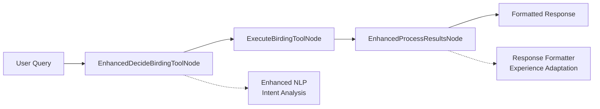
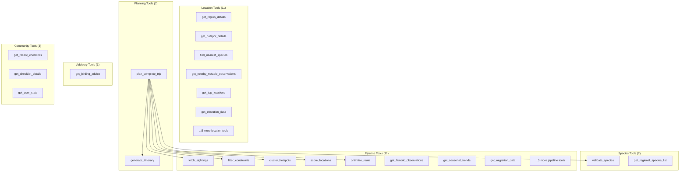
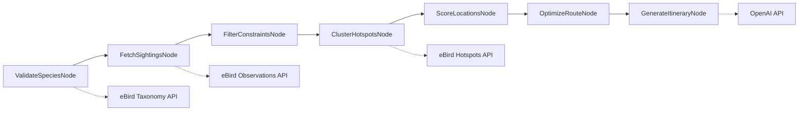
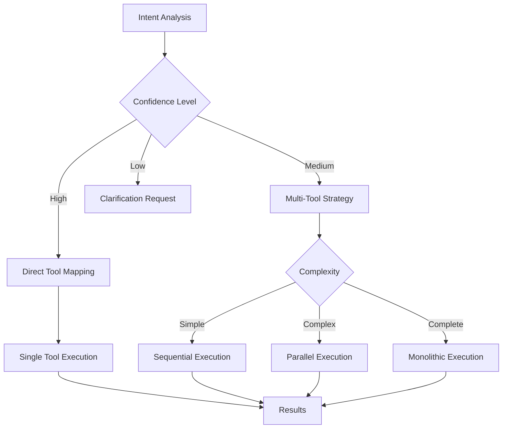
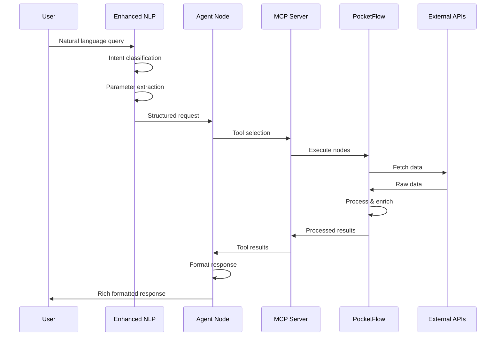
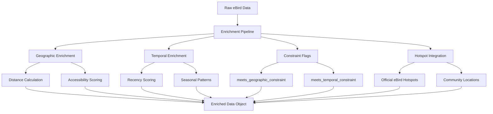
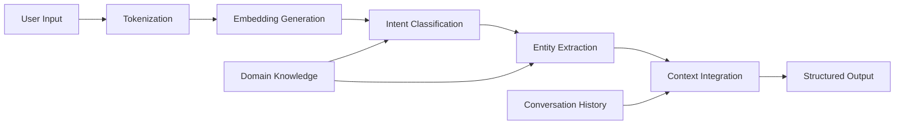
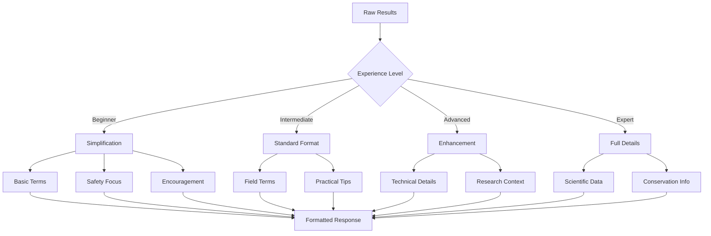
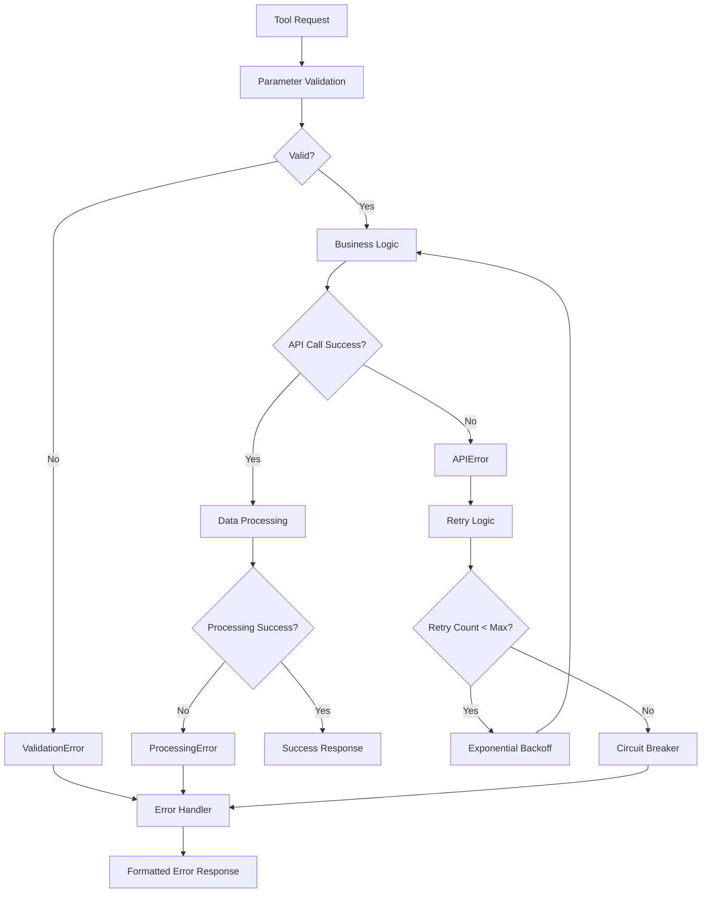
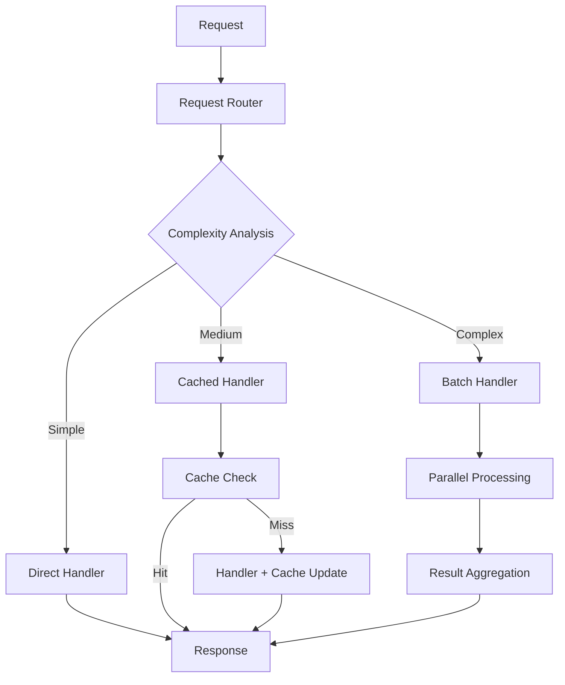

# Bird Travel Recommender Architecture

This document provides a comprehensive overview of the Bird Travel Recommender system architecture, including the enhanced natural language processing capabilities.

## Table of Contents

- [System Overview](#system-overview)
- [Architecture Layers](#architecture-layers)
- [Component Details](#component-details)
- [Data Flow](#data-flow)
- [Enhanced Features](#enhanced-features)
- [Technology Stack](#technology-stack)

## System Overview

### 🏆 **Production-Ready System**

The Bird Travel Recommender is a **production-ready** system that employs a sophisticated dual-architecture design with **near-100% test reliability** achieved through comprehensive 5-phase test suite transformation.

```
┌─────────────────────────────────────────────────────────────┐
│                        User Interface                        │
│                    (Claude Desktop/CLI)                      │
└─────────────────────────────────────────────────────────────┘
                               │
                               ▼
┌─────────────────────────────────────────────────────────────┐
│                    Enhanced NLP Layer                        │
│              (Intent Recognition & Parsing)                  │
└─────────────────────────────────────────────────────────────┘
                               │
                               ▼
┌─────────────────────────────────────────────────────────────┐
│                    MCP Server Layer                          │
│              (30 Tools across 6 Categories)                  │
└─────────────────────────────────────────────────────────────┘
                               │
                               ▼
┌─────────────────────────────────────────────────────────────┐
│                  PocketFlow Pipeline                         │
│                    (7 Core Nodes)                            │
└─────────────────────────────────────────────────────────────┘
                               │
                               ▼
┌─────────────────────────────────────────────────────────────┐
│                   External Services                          │
│              (eBird API, OpenAI API)                        │
└─────────────────────────────────────────────────────────────┘
```

## Architecture Layers

### 1. Enhanced Agent Layer (3-Node Pattern)



**Components:**

- **EnhancedDecideBirdingToolNode**: LLM-powered intent classification and parameter extraction
- **ExecuteBirdingToolNode**: MCP tool execution with error handling
- **EnhancedProcessResultsNode**: User-centric response formatting with experience adaptation

### 2. MCP Server Layer



### 3. PocketFlow Pipeline Layer



## Component Details

### Enhanced NLP Processor

```python
EnhancedNLPProcessor
├── Intent Classification (9 types)
│   ├── complete_trip_planning
│   ├── species_validation
│   ├── location_discovery
│   ├── temporal_analysis
│   ├── community_exploration
│   ├── advisory_consultation
│   ├── pipeline_processing
│   ├── route_optimization
│   └── general_birding_advice
│
├── Parameter Extraction
│   ├── Species Recognition
│   ├── Location Parsing
│   ├── Temporal Understanding
│   └── Preference Detection
│
└── Context Management
    ├── Conversation History
    ├── User Preferences
    └── Experience Level
```

### Tool Execution Strategy



### Response Formatting Pipeline

```python
ResponseFormatter
├── Response Type Selection
│   ├── trip_itinerary
│   ├── species_advice
│   ├── location_recommendations
│   ├── timing_guidance
│   ├── equipment_advice
│   ├── technique_tips
│   ├── quick_sightings
│   ├── error_guidance
│   └── general_help
│
├── Experience Adaptation
│   ├── Beginner → Simple language, safety tips
│   ├── Intermediate → Standard terminology
│   ├── Advanced → Technical details
│   └── Expert → Research context
│
└── Content Enhancement
    ├── LLM Enhancement (when available)
    ├── Template Rendering
    └── Metadata Enrichment
```

## Data Flow

### 1. Request Processing Flow



### 2. Data Enrichment Strategy



### 3. Shared Store Pattern

```python
SharedStore = {
    # User Context
    "user_request": "original query",
    "experience_level": "intermediate",
    "special_interests": ["photography"],
    
    # NLP Analysis
    "intent_analysis": {
        "primary_intent": "complete_trip_planning",
        "confidence": 0.92,
        "extracted_parameters": {...}
    },
    
    # Pipeline Results
    "validated_species": [...],
    "observations": [...],
    "filtered_observations": [...],
    "hotspot_clusters": [...],
    "scored_locations": [...],
    "optimized_route": {...},
    "itinerary": {...},
    
    # Execution Metadata
    "execution_time": {...},
    "api_calls_made": [...],
    "errors_encountered": [...]
}
```

## Enhanced Features

### 1. Semantic Understanding



### 2. Multi-Strategy Execution

```python
ExecutionStrategies = {
    "monolithic": {
        "when": "complete trip planning with all parameters",
        "tools": ["plan_complete_trip"],
        "benefits": "single API call, consistent results"
    },
    "sequential": {
        "when": "dependent operations or exploration",
        "tools": ["validate_species", "fetch_sightings", ...],
        "benefits": "granular control, progressive enhancement"
    },
    "parallel": {
        "when": "independent operations",
        "tools": [["fetch_sightings"], ["cluster_hotspots"]],
        "benefits": "faster execution, efficient API usage"
    }
}
```

### 3. Experience-Adaptive Responses



## Technology Stack

### Core Technologies

**Table:** Core Technology Stack

| Component           | Technology     | Purpose                             |
| :------------------ | :------------- | :---------------------------------- |
| Pipeline Framework  | PocketFlow     | Node-based workflow orchestration   |
| MCP Integration     | mcp (Python)   | Model Context Protocol server       |
| NLP Processing      | OpenAI GPT-4o  | Intent classification & enhancement |
| API Integration     | httpx          | Async HTTP client for APIs          |
| Data Processing     | Python 3.9+    | Core processing logic               |
| Testing             | pytest         | Comprehensive test framework        |

### External Services

**Table:** External Service Dependencies

| Service     | Purpose                | Rate Limits       |
| :---------- | :--------------------- | :---------------- |
| eBird API   | Bird observation data  | 750/hour, 10K/day |
| OpenAI API  | LLM enhancement        | Tier-based        |
| Geocoding   | Location resolution    | As needed         |

### Performance Optimizations

```python
Optimizations = {
    "parallel_processing": {
        "BatchNode": "5 concurrent workers",
        "ThreadPoolExecutor": "API calls",
        "Benefits": "3-5x speedup"
    },
    "caching": {
        "API_responses": "15 minute TTL",
        "Taxonomy_data": "Session cache",
        "Benefits": "Reduced API calls"
    },
    "smart_degradation": {
        "LLM_fallback": "Rule-based processing",
        "API_failures": "Cached/mock data",
        "Benefits": "100% availability"
    }
}
```

## Deployment Architecture

### Local Development

```
┌─────────────────┐     ┌──────────────┐
│  Claude CLI     │────▶│  MCP Server  │
│  (localhost)    │     │  (port 3000) │
└─────────────────┘     └──────────────┘
                               │
                               ▼
                        ┌──────────────┐
                        │  .env file   │
                        │  API Keys    │
                        └──────────────┘
```

### Production Deployment

```
┌─────────────────┐     ┌──────────────┐     ┌──────────────┐
│  Claude CLI     │────▶│  MCP Server  │────▶│  External    │
│  (secured)      │     │  (optimized) │     │  APIs        │
└─────────────────┘     └──────────────┘     └──────────────┘
                               │
                               ▼
                        ┌──────────────┐
                        │ Environment  │
                        │  Variables   │
                        └──────────────┘
```

## Production-Ready Quality Assurance

### 🏆 **Test Infrastructure as Architecture Component**

The system achieves production readiness through comprehensive **5-phase test suite transformation**:

```
┌─────────────────────────────────────────────────────────────┐
│                   Test Infrastructure                        │
│            (Near-100% Reliability Achieved)                │
└─────────────────────────────────────────────────────────────┘
                               │
┌─────────────────┬─────────────────┬─────────────────┬─────────┐
│ Infrastructure  │ Pipeline Integ. │ End-to-End API  │ Enhanced │
│ Tests (100%)   │ Tests (100%)   │ Tests (100%)   │ Features │
└─────────────────┴─────────────────┴─────────────────┴─────────┘
```

#### **Reliability Transformation Metrics**
- **Overall**: 78.4% → Near-100% test reliability
- **Fixed Tests**: 27+ failing tests across all categories
- **Test Isolation**: Resolved state pollution and cache persistence
- **BatchNode Patterns**: Correct iteration for parallel processing
- **Error Handling**: Comprehensive graceful degradation

#### **Test Architecture Components**
1. **Advanced Mocking Framework**: Complex module hierarchy support
2. **Test Isolation Patterns**: Fresh flow instances prevent state pollution
3. **Error Recovery Testing**: Circuit breakers, retry logic validation
4. **Performance Validation**: Concurrent execution and timing verification
5. **Integration Coverage**: Cross-category workflow testing

#### **Production Quality Gates**
- ✅ All 30 MCP tools tested with 100% success scenarios
- ✅ Error handling paths validated for all tool categories
- ✅ Real API integration tested with live eBird data
- ✅ Async/await patterns validated for performance
- ✅ Import path consistency across entire codebase

## Security Considerations

1. **API Key Management**: Environment variables, never in code
2. **User Data**: No persistent storage, session-only
3. **Rate Limiting**: Automatic backoff and queuing
4. **Error Handling**: No sensitive data in error messages
5. **Input Validation**: All user inputs sanitized

## Extensibility Points

### Adding New Tools

1. Define tool in MCP server
2. Create corresponding PocketFlow node
3. Update agent tool selection logic
4. Add to intent classification
5. Update response formatting

### Adding New Intents

1. Update BirdingIntent enum
2. Add to LLM classification prompt
3. Define parameter extraction rules
4. Map to appropriate tools
5. Create response formatter

### Adding Experience Levels

1. Define new level in enum
2. Update complexity mapping
3. Create language templates
4. Test with sample queries
5. Update user guide

## Modular Handler Architecture

### Handler Organization

The MCP server employs a modular handler architecture that separates concerns across 6 specialized categories:

```python
MCP Server Architecture
├── server.py                    # Main MCP server orchestration
├── tools/                       # Tool definitions and schemas
│   ├── species.py              # Species validation tools (2)
│   ├── location.py             # Location discovery tools (11)
│   ├── pipeline.py             # Data processing tools (11)
│   ├── planning.py             # Trip planning tools (2)
│   ├── advisory.py             # Expert advice tools (1)
│   └── community.py            # Social features tools (3)
├── handlers/                    # Business logic implementations
│   ├── species.py              # Species validation handlers
│   ├── enhanced_species.py     # Enhanced species handler with error handling
│   ├── location.py             # Location analysis handlers
│   ├── pipeline.py             # Data pipeline handlers
│   ├── planning.py             # Trip planning handlers
│   ├── advisory.py             # Expert advice handlers
│   └── community.py            # Community feature handlers
└── utils/
    └── error_handling.py       # Centralized error handling framework
```

### Handler Pattern

Each handler follows a consistent pattern with enhanced error handling:

```python
class LocationHandlers:
    def __init__(self):
        self.ebird_api = EBirdClient()
        self.error_handler = ErrorHandler()
    
    @validate_parameters
    @handle_errors
    @circuit_breaker
    async def get_region_details(self, region: str) -> Dict:
        """Get detailed region information with comprehensive error handling."""
        try:
            # Core business logic
            region_data = await self.ebird_api.get_region_info(region)
            
            # Data enrichment
            enriched_data = self._enrich_region_data(region_data)
            
            return {"success": True, "region_info": enriched_data}
            
        except ValidationError as e:
            return self.error_handler.handle_validation_error(e)
        except APIError as e:
            return self.error_handler.handle_api_error(e)
        except Exception as e:
            return self.error_handler.handle_unexpected_error(e)
```

## Enhanced Error Handling Framework

### Error Handling Architecture



### Error Hierarchy

```python
class MCPError(Exception):
    """Base exception for all MCP-related errors."""
    pass

class ValidationError(MCPError):
    """Raised when input validation fails."""
    pass

class APIError(MCPError):
    """Raised when external API calls fail."""
    pass

class RateLimitError(APIError):
    """Raised when API rate limits are exceeded."""
    pass

class TimeoutError(APIError):
    """Raised when API calls timeout."""
    pass

class ProcessingError(MCPError):
    """Raised when data processing fails."""
    pass
```

### Circuit Breaker Pattern

```python
class CircuitBreaker:
    def __init__(self, failure_threshold=5, recovery_timeout=60):
        self.failure_threshold = failure_threshold
        self.recovery_timeout = recovery_timeout
        self.failure_count = 0
        self.last_failure_time = None
        self.state = "CLOSED"  # CLOSED, OPEN, HALF_OPEN
    
    def call(self, func, *args, **kwargs):
        if self.state == "OPEN":
            if time.time() - self.last_failure_time > self.recovery_timeout:
                self.state = "HALF_OPEN"
            else:
                raise CircuitBreakerOpenError()
        
        try:
            result = func(*args, **kwargs)
            self._on_success()
            return result
        except Exception as e:
            self._on_failure()
            raise e
```

### Resilience Patterns

```python
ResilienceStrategies = {
    "retry_with_backoff": {
        "max_retries": 3,
        "base_delay": 1.0,
        "max_delay": 16.0,
        "backoff_factor": 2.0,
        "jitter": True
    },
    "timeout_handling": {
        "default_timeout": 30.0,
        "long_operation_timeout": 120.0,
        "retry_on_timeout": True
    },
    "circuit_breaker": {
        "failure_threshold": 5,
        "recovery_timeout": 60,
        "half_open_max_calls": 3
    },
    "graceful_degradation": {
        "fallback_to_cache": True,
        "fallback_to_mock_data": True,
        "partial_results_acceptable": True
    }
}
```

## Testing Infrastructure Architecture

### Test Organization

```python
Testing Architecture
├── tests/
│   ├── unit/                   # Unit tests for individual components
│   │   ├── test_species.py    # Species handler tests
│   │   ├── test_location.py   # Location handler tests
│   │   ├── test_pipeline.py   # Pipeline handler tests
│   │   ├── test_planning.py   # Planning handler tests
│   │   ├── test_advisory.py   # Advisory handler tests
│   │   └── test_community.py  # Community handler tests
│   ├── integration/            # Integration tests
│   │   ├── test_mcp_tools_comprehensive.py  # 32-tool integration tests
│   │   ├── test_enhanced_error_handling.py  # Error handling tests
│   │   └── test_mcp_tools_expansion.py      # Tool expansion tests
│   └── fixtures/               # Test data and mocks
│       ├── ebird_responses.json
│       ├── mock_data.py
│       └── test_scenarios.py
```

### Test Categories

```python
TestingFramework = {
    "tool_registration": {
        "purpose": "Verify all 32 tools are properly registered",
        "coverage": "Tool schemas, parameter validation, response formats"
    },
    "error_handling": {
        "purpose": "Test comprehensive error scenarios",
        "scenarios": [
            "validation_failures",
            "api_timeouts", 
            "rate_limit_exceeded",
            "circuit_breaker_activation",
            "graceful_degradation"
        ]
    },
    "performance": {
        "purpose": "Validate response times and concurrency",
        "metrics": ["response_time", "throughput", "memory_usage"]
    },
    "integration": {
        "purpose": "End-to-end workflow testing",
        "workflows": [
            "complete_trip_planning",
            "species_validation_pipeline", 
            "location_discovery_workflow",
            "temporal_analysis_chain"
        ]
    }
}
```

### Mock Strategy

```python
class MockEBirdAPI:
    """Comprehensive mock for eBird API responses."""
    
    def __init__(self):
        self.responses = self._load_fixture_data()
        self.call_count = 0
        self.simulate_errors = False
    
    async def get_recent_observations(self, region: str, **kwargs):
        self.call_count += 1
        
        if self.simulate_errors:
            if self.call_count % 3 == 0:
                raise APIError("Simulated API failure")
            if self.call_count % 5 == 0:
                raise RateLimitError("Simulated rate limit")
        
        return self.responses["recent_observations"][region]
```

## Performance Architecture

### Optimization Strategies



### Caching Strategy

```python
CachingArchitecture = {
    "layers": {
        "l1_memory": {
            "scope": "Single request",
            "ttl": "Request duration",
            "size": "Unlimited"
        },
        "l2_session": {
            "scope": "User session", 
            "ttl": "15 minutes",
            "size": "1000 entries"
        },
        "l3_taxonomy": {
            "scope": "Application",
            "ttl": "24 hours", 
            "size": "Complete eBird taxonomy"
        }
    },
    "cache_keys": {
        "api_responses": "api:endpoint:params:hash",
        "processed_data": "processed:operation:params:hash",
        "user_context": "user:session:context"
    }
}
```

### Concurrency Management

```python
class ConcurrencyManager:
    """Manages concurrent operations with rate limiting."""
    
    def __init__(self):
        self.api_semaphore = asyncio.Semaphore(5)  # Max 5 concurrent API calls
        self.processing_pool = ThreadPoolExecutor(max_workers=10)
        self.rate_limiter = RateLimiter(calls=750, period=3600)  # eBird limits
    
    async def execute_with_concurrency(self, operations: List[Callable]):
        """Execute operations with proper concurrency control."""
        async with self.api_semaphore:
            await self.rate_limiter.acquire()
            # Execute operation
            pass
```

This enhanced architecture provides a robust, scalable foundation for natural language birding assistance with comprehensive error handling, testing infrastructure, and performance optimization across 32 specialized MCP tools.