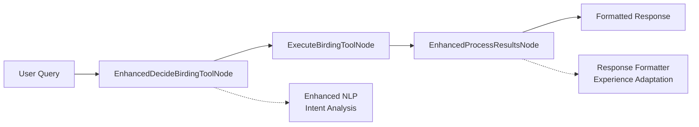
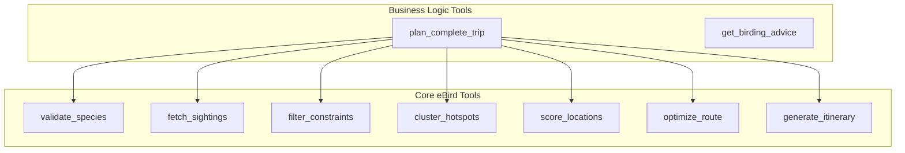
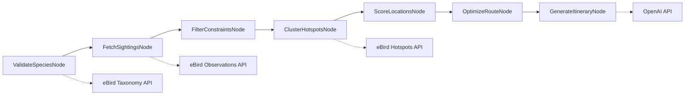
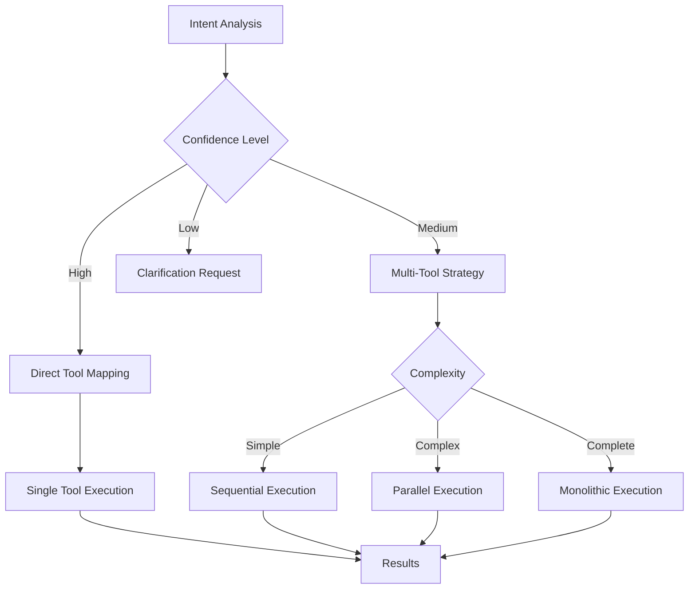
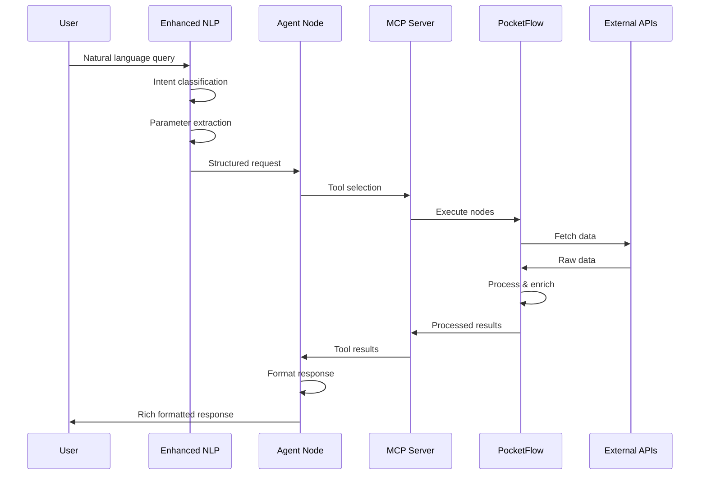
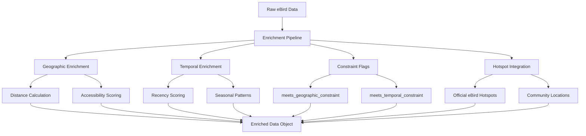
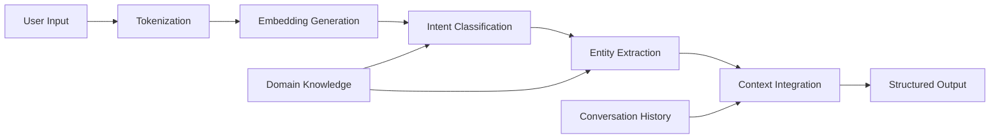
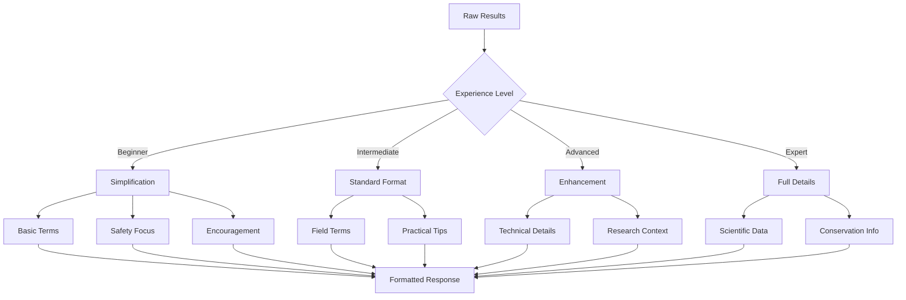

# Bird Travel Recommender Architecture

This document provides a comprehensive overview of the Bird Travel Recommender system architecture, including the enhanced natural language processing capabilities.

## Table of Contents

- [System Overview](#system-overview)
- [Architecture Layers](#architecture-layers)
- [Component Details](#component-details)
- [Data Flow](#data-flow)
- [Enhanced Features](#enhanced-features)
- [Technology Stack](#technology-stack)

## System Overview

The Bird Travel Recommender employs a sophisticated dual-architecture design:

```
┌─────────────────────────────────────────────────────────────┐
│                        User Interface                        │
│                    (Claude Desktop/CLI)                      │
└─────────────────────────────────────────────────────────────┘
                               │
                               ▼
┌─────────────────────────────────────────────────────────────┐
│                    Enhanced NLP Layer                        │
│              (Intent Recognition & Parsing)                  │
└─────────────────────────────────────────────────────────────┘
                               │
                               ▼
┌─────────────────────────────────────────────────────────────┐
│                    MCP Server Layer                          │
│                    (9 Birding Tools)                         │
└─────────────────────────────────────────────────────────────┘
                               │
                               ▼
┌─────────────────────────────────────────────────────────────┐
│                  PocketFlow Pipeline                         │
│                    (7 Core Nodes)                            │
└─────────────────────────────────────────────────────────────┘
                               │
                               ▼
┌─────────────────────────────────────────────────────────────┐
│                   External Services                          │
│              (eBird API, OpenAI API)                        │
└─────────────────────────────────────────────────────────────┘
```

## Architecture Layers

### 1. Enhanced Agent Layer (3-Node Pattern)



**Components:**

- **EnhancedDecideBirdingToolNode**: LLM-powered intent classification and parameter extraction
- **ExecuteBirdingToolNode**: MCP tool execution with error handling
- **EnhancedProcessResultsNode**: User-centric response formatting with experience adaptation

### 2. MCP Server Layer



### 3. PocketFlow Pipeline Layer



## Component Details

### Enhanced NLP Processor

```python
EnhancedNLPProcessor
├── Intent Classification (9 types)
│   ├── complete_trip_planning
│   ├── species_advice
│   ├── location_discovery
│   ├── timing_advice
│   ├── equipment_advice
│   ├── technique_advice
│   ├── quick_lookup
│   ├── route_optimization
│   └── general_advice
│
├── Parameter Extraction
│   ├── Species Recognition
│   ├── Location Parsing
│   ├── Temporal Understanding
│   └── Preference Detection
│
└── Context Management
    ├── Conversation History
    ├── User Preferences
    └── Experience Level
```

### Tool Execution Strategy



### Response Formatting Pipeline

```python
ResponseFormatter
├── Response Type Selection
│   ├── trip_itinerary
│   ├── species_advice
│   ├── location_recommendations
│   ├── timing_guidance
│   ├── equipment_advice
│   ├── technique_tips
│   ├── quick_sightings
│   ├── error_guidance
│   └── general_help
│
├── Experience Adaptation
│   ├── Beginner → Simple language, safety tips
│   ├── Intermediate → Standard terminology
│   ├── Advanced → Technical details
│   └── Expert → Research context
│
└── Content Enhancement
    ├── LLM Enhancement (when available)
    ├── Template Rendering
    └── Metadata Enrichment
```

## Data Flow

### 1. Request Processing Flow



### 2. Data Enrichment Strategy



### 3. Shared Store Pattern

```python
SharedStore = {
    # User Context
    "user_request": "original query",
    "experience_level": "intermediate",
    "special_interests": ["photography"],
    
    # NLP Analysis
    "intent_analysis": {
        "primary_intent": "complete_trip_planning",
        "confidence": 0.92,
        "extracted_parameters": {...}
    },
    
    # Pipeline Results
    "validated_species": [...],
    "observations": [...],
    "filtered_observations": [...],
    "hotspot_clusters": [...],
    "scored_locations": [...],
    "optimized_route": {...},
    "itinerary": {...},
    
    # Execution Metadata
    "execution_time": {...},
    "api_calls_made": [...],
    "errors_encountered": [...]
}
```

## Enhanced Features

### 1. Semantic Understanding



### 2. Multi-Strategy Execution

```python
ExecutionStrategies = {
    "monolithic": {
        "when": "complete trip planning with all parameters",
        "tools": ["plan_complete_trip"],
        "benefits": "single API call, consistent results"
    },
    "sequential": {
        "when": "dependent operations or exploration",
        "tools": ["validate_species", "fetch_sightings", ...],
        "benefits": "granular control, progressive enhancement"
    },
    "parallel": {
        "when": "independent operations",
        "tools": [["fetch_sightings"], ["cluster_hotspots"]],
        "benefits": "faster execution, efficient API usage"
    }
}
```

### 3. Experience-Adaptive Responses



## Technology Stack

### Core Technologies

| Component | Technology | Purpose |
|-----------|------------|---------|
| Pipeline Framework | PocketFlow | Node-based workflow orchestration |
| MCP Integration | mcp (Python) | Model Context Protocol server |
| NLP Processing | OpenAI GPT-4o | Intent classification & enhancement |
| API Integration | httpx | Async HTTP client for APIs |
| Data Processing | Python 3.9+ | Core processing logic |
| Testing | pytest | Comprehensive test framework |

### External Services

| Service | Purpose | Rate Limits |
|---------|---------|-------------|
| eBird API | Bird observation data | 750/hour, 10K/day |
| OpenAI API | LLM enhancement | Tier-based |
| Geocoding | Location resolution | As needed |

### Performance Optimizations

```python
Optimizations = {
    "parallel_processing": {
        "BatchNode": "5 concurrent workers",
        "ThreadPoolExecutor": "API calls",
        "Benefits": "3-5x speedup"
    },
    "caching": {
        "API_responses": "15 minute TTL",
        "Taxonomy_data": "Session cache",
        "Benefits": "Reduced API calls"
    },
    "smart_degradation": {
        "LLM_fallback": "Rule-based processing",
        "API_failures": "Cached/mock data",
        "Benefits": "100% availability"
    }
}
```

## Deployment Architecture

### Local Development

```
┌─────────────────┐     ┌──────────────┐
│  Claude CLI     │────▶│  MCP Server  │
│  (localhost)    │     │  (port 3000) │
└─────────────────┘     └──────────────┘
                               │
                               ▼
                        ┌──────────────┐
                        │  .env file   │
                        │  API Keys    │
                        └──────────────┘
```

### Production Deployment

```
┌─────────────────┐     ┌──────────────┐     ┌──────────────┐
│  Claude CLI     │────▶│  MCP Server  │────▶│  External    │
│  (secured)      │     │  (optimized) │     │  APIs        │
└─────────────────┘     └──────────────┘     └──────────────┘
                               │
                               ▼
                        ┌──────────────┐
                        │ Environment  │
                        │  Variables   │
                        └──────────────┘
```

## Security Considerations

1. **API Key Management**: Environment variables, never in code
2. **User Data**: No persistent storage, session-only
3. **Rate Limiting**: Automatic backoff and queuing
4. **Error Handling**: No sensitive data in error messages
5. **Input Validation**: All user inputs sanitized

## Extensibility Points

### Adding New Tools

1. Define tool in MCP server
2. Create corresponding PocketFlow node
3. Update agent tool selection logic
4. Add to intent classification
5. Update response formatting

### Adding New Intents

1. Update BirdingIntent enum
2. Add to LLM classification prompt
3. Define parameter extraction rules
4. Map to appropriate tools
5. Create response formatter

### Adding Experience Levels

1. Define new level in enum
2. Update complexity mapping
3. Create language templates
4. Test with sample queries
5. Update user guide

This architecture provides a robust, scalable foundation for natural language birding assistance with seamless integration between modern LLM capabilities and traditional API services.