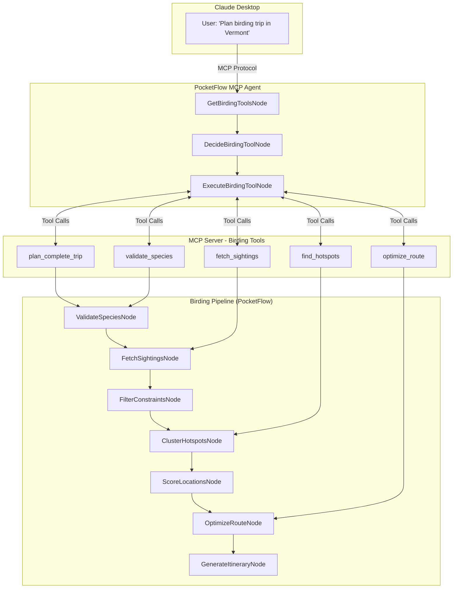
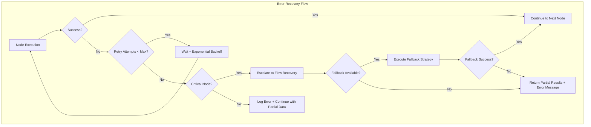

# Design Doc: Bird Travel Recommender

> Please DON'T remove notes for AI

## Requirements

> Notes for AI: Keep it simple and clear.
> If the requirements are abstract, write concrete user stories

### Core Problem Statement
Given a list of target bird species and travel constraints, generate an optimal route that maximizes observation probability while minimizing travel time. The solution must be accessible through natural language conversation in Claude Desktop via Model Context Protocol (MCP).

### User Stories
1. **Fall Migration Enthusiast**: "I want to see 5 specific warblers during fall migration in New England over a 3-day weekend"
2. **Winter Birding Trip**: "Plan a weekend trip from Boston to see winter waterfowl within 2 hours drive"
3. **Photography Focus**: "Find the best spots for photographing raptors within my region, ordered by recent activity"
4. **Quick Lookup**: "Show me recent cardinal sightings near Boston"
5. **Hotspot Discovery**: "What are the best birding locations within 50km of Hartford, CT?"

### Success Criteria
- Generate routes that include recent sighting data from eBird
- Optimize travel distance while maximizing species diversity
- Provide actionable itinerary with GPS coordinates and hotspot details
- Handle edge cases (rare species, no recent sightings)
- **Accessible via natural language in Claude Desktop through MCP**
- **Modular tools for both complete planning and individual queries**
- **Toggle between local development and MCP deployment modes**

## Flow Design

> Notes for AI:
> 1. Consider the design patterns of agent, map-reduce, rag, and workflow. Apply them if they fit.
> 2. Present a concise, high-level description of the workflow.

### Applicable Design Pattern:

**Primary**: Agent (PocketFlow 3-node MCP agent pattern)
**Secondary**: Workflow (birding pipeline nodes exposed as MCP tools)
**Tertiary**: Map-Reduce (fetch sightings for multiple species in parallel)

### Dual Architecture Design:

#### 1. MCP Agent Layer (User Interface)
Following PocketFlow's MCP cookbook pattern:
1. **GetBirdingToolsNode**: Discover available birding tools from MCP server
2. **DecideBirdingToolNode**: Use LLM to select appropriate tool based on user query
3. **ExecuteBirdingToolNode**: Execute selected tool and return formatted results

#### 2. Birding Pipeline Layer (Business Logic)
Core birding workflow exposed as MCP tools:
1. **ValidateSpeciesNode**: Validate bird species names against eBird taxonomy
2. **FetchSightingsNode**: Query eBird API for recent sightings (BatchNode for parallel processing)
3. **FilterConstraintsNode**: Apply user constraints (region, dates, distance)
4. **ClusterHotspotsNode**: Group nearby locations to minimize travel
5. **ScoreLocationsNode**: Rank locations by species diversity and sighting frequency
6. **OptimizeRouteNode**: Calculate optimal visiting order using TSP-style algorithm
7. **GenerateItineraryNode**: Format final markdown itinerary with maps and details



### Implementation Modes

**Development Mode** (`USE_MCP = False`):
- Direct execution of birding pipeline for testing
- Local debugging and development
- Fast iteration on node logic

**Production Mode** (`USE_MCP = True`):
- MCP server exposes tools to Claude Desktop
- Agent pattern handles natural language queries
- Modular tool execution based on user intent

## Utility Functions

> Notes for AI:
> 1. Understand the utility function definition thoroughly by reviewing the doc.
> 2. Include only the necessary utility functions, based on nodes in the flow.

### Core Birding Utilities

1. **Call LLM** (`utils/call_llm.py`)
   - *Input*: prompt (str), context_type (str, optional)
   - *Output*: response (str)
   - *Enhanced Prompting*: Domain-specific prompts with birding expertise context
   - Used by ValidateSpeciesNode, DecideBirdingToolNode, and GenerateItineraryNode with specialized birding knowledge

2. **eBird API Client** (`utils/ebird_api.py`)
   - *Core Architecture*: Centralized `make_request()` method with consistent error handling
   - *Primary Functions* (based on ebird-mcp-server patterns):
     - `get_recent_observations(region_code, days_back=7, species_code=None, include_provisional=False)` → List[dict]
     - `get_nearby_observations(lat, lng, distance_km=25, days_back=7, species_code=None)` → List[dict]
     - `get_notable_observations(region_code, days_back=7, detail="simple")` → List[dict]
     - `get_species_observations(species_code, region_code, days_back=7, hotspot_only=False)` → List[dict]
     - `get_hotspots(region_code, format="json")` → List[dict]
     - `get_nearby_hotspots(lat, lng, distance_km=25)` → List[dict]
     - `get_taxonomy(species_codes=None, format="json", locale="en")` → List[dict]
   - *Authentication*: Uses EBIRD_API_KEY environment variable with X-eBirdApiToken header
   - *Error Handling*: HTTP status codes, rate limiting with exponential backoff, empty results gracefully handled
   - *Request Patterns*: Promise-based async with configurable parameters and fallback mechanisms
   - *Response Processing*: Consistent data normalization across different endpoint formats
   - Used by all nodes requiring eBird data access with unified interface

3. **Location Distance Calculator** (`utils/geo_utils.py`)
   - *Input*: lat1, lng1, lat2, lng2 (float)
   - *Output*: distance in kilometers (float)
   - Used by ClusterHotspotsNode and OptimizeRouteNode for spatial calculations

4. **Route Optimizer** (`utils/route_optimizer.py`)
   - *Input*: start_location, locations_list
   - *Output*: optimized route with distances
   - Used by OptimizeRouteNode for TSP-style route planning

### MCP Integration Utilities

5. **MCP Tool Registry** (`utils/mcp_tools.py`)
   - *Input*: tool definitions and metadata
   - *Output*: available tools list for discovery
   - Used by GetBirdingToolsNode to enumerate available birding functions

6. **MCP Client Interface** (`utils/mcp_client.py`)
   - *Input*: tool_name (str), parameters (dict)
   - *Output*: tool execution results
   - Used by ExecuteBirdingToolNode to call MCP server tools

7. **Mode Toggle** (`utils/config.py`)
   - *Input*: USE_MCP boolean flag
   - *Output*: execution mode configuration
   - Used throughout application to switch between local and MCP execution

### Enhanced LLM Prompting Strategies

To leverage Claude's built-in birding knowledge without external data dependencies:

**ValidateSpeciesNode Prompting:**
```python
species_validation_prompt = f"""
You are an expert ornithologist with comprehensive knowledge of North American birds.
Given these bird names: {species_list}

For each name:
1. Provide the correct common name (handle variations like "cardinal" → "Northern Cardinal")
2. Include the scientific name
3. Note any seasonal considerations (migration timing, breeding vs wintering range)
4. Flag any names that might be ambiguous or incorrect

Consider regional variations and colloquial names. Return structured data for eBird API lookup.
"""
```

**GenerateItineraryNode Prompting:**
```python
itinerary_prompt = f"""
You are a professional birding guide with extensive field experience.
Create a detailed birding itinerary for: {target_species} in {region}

Include expert advice on:
- Best times of day for each species (feeding, activity patterns)
- Habitat preferences and where to look within each location
- Seasonal timing and migration considerations
- Weather conditions that favor good sightings
- Equipment recommendations and photography tips
- Local birding etiquette and access considerations

Format as a professional birding trip itinerary with specific actionable guidance.
"""
```

**ScoreLocationsNode Prompting:**
```python
location_scoring_prompt = f"""
You are an expert birder evaluating locations for observing: {species_list}

For each location, consider:
- Habitat suitability for target species
- Seasonal timing and migration patterns
- Time of day effectiveness
- Weather condition preferences
- Accessibility and birding logistics

Rank locations by probability of successful sightings, explaining your reasoning
based on species ecology and behavior patterns.
"""
```

**DecideBirdingToolNode Prompting:**
```python
tool_selection_prompt = f"""
You are an expert birding guide helping users plan bird observation trips.
User query: "{user_query}"

Available tools: {available_tools}

Tool Selection Logic:
1. **Primary Strategy - Granular Tool Orchestration**:
   - Default approach for all complex queries requiring multi-step processing
   - Sequence: validate_species → fetch_sightings → find_hotspots → optimize_route
   - Inspect each step output and adapt subsequent tool calls
   - Stop orchestration and return partial results if critical steps fail (e.g., no species found, empty sightings)
   
2. **Fallback Strategy - Monolithic Tool**:
   - Use plan_complete_trip ONLY when:
     - Simple, unambiguous request with all parameters clear
     - User explicitly requests "complete trip planning"
     - Orchestration has failed 2+ times and user wants simplified approach
   
3. **Error Recovery Decision Points**:
   - If validate_species fails: Ask user to clarify species names
   - If fetch_sightings returns empty: Suggest alternative regions or time periods
   - If optimize_route fails: Return unoptimized location list with distances
   - If >50% of pipeline fails: Offer monolithic tool as fallback

4. **Partial Result Strategy**:
   - Always return useful partial results rather than complete failure
   - Example: "Found 3 of 5 species, here are the best locations for those..."

Choose the orchestration strategy that maximizes user value while handling failures gracefully.
"""
```

## eBird API Integration Strategy

> Notes for AI: This section defines our approach to eBird API integration, including wrapper evaluation, implementation strategy, and specific technical details.

### API Research and Documentation

**Primary Sources:**
- Official eBird API 2.0 Documentation: https://documenter.getpostman.com/view/664302/S1ENwy59
- Digital Conservation Tutorial: `docs/Digital Conservation - eBird API Tutorial.md`
- Python Wrapper Analysis: https://github.com/ProjectBabbler/ebird-api

**Key Findings:**
- eBird API returns only the most recent observation per species per location (not comprehensive data)
- Observer bias: data concentrated where eBird users are active (cities, parks)
- Maximum 30-day historical lookback period
- Rate limits exist but are not clearly documented

### Implementation Approach: Proven Pattern Adaptation

**Decision Rationale:**
- **Foundation**: Use proven patterns from moonbirdai/ebird-mcp-server (JavaScript) as blueprint
- **Adaptation**: Port successful architectural patterns to Python while maintaining simplicity
- **Validation**: Leverage working tool schemas and parameter patterns from production MCP server

**Operationalization:**
1. **Core Client Architecture**: Implement centralized `make_request()` pattern with consistent error handling
2. **Tool Schema Alignment**: Match parameter names and response formats from working JavaScript implementation
3. **Error Handling Patterns**: Adopt proven fallback mechanisms and graceful degradation strategies
4. **Request Optimization**: Implement connection pooling and caching patterns for production deployment

#### Proven Implementation Patterns from ebird-mcp-server

**Core Client Design Patterns:**
- **Centralized Request Handler**: Single `makeRequest()` method handles all HTTP interactions
- **Consistent Parameter Patterns**: Standardized parameter names across all tool functions
- **Graceful Error Handling**: HTTP errors returned as formatted messages rather than exceptions
- **Flexible Response Processing**: Support for different detail levels and output formats

**MCP Tool Integration Patterns:**
- **Tool Discovery**: Automatic tool enumeration with schema validation
- **Parameter Validation**: JSON schema validation for all tool inputs
- **Response Formatting**: Consistent text formatting for Claude Desktop consumption
- **Debug Support**: Configurable logging and error reporting for development

**API Interaction Patterns:**
- **Rate Limit Respect**: Built-in delays and exponential backoff for API throttling
- **Connection Management**: HTTP connection reuse for multiple sequential requests
- **Response Caching**: Optional caching for hotspot and taxonomy data (low change frequency)
- **Fallback Mechanisms**: Alternative endpoints and data sources for failed requests

### eBird API Technical Specifications

#### Authentication
```python
# Required header format
headers = {"X-eBirdApiToken": "YOUR_API_KEY"}

# Environment variable setup
EBIRD_API_KEY = "your_key_from_https://ebird.org/api/keygen"
```

#### Core Endpoints for Implementation

**1. Recent Observations in Region**
- **URL**: `/v2/data/obs/{regionCode}/recent`
- **Purpose**: Get most recent observation per species in region
- **Key Parameters**: `regionCode` (US-MA, CA-ON), `back` (days, max 30)
- **Used by**: General species discovery, ValidateSpeciesNode

**2. Recent Observations by Species**
- **URL**: `/v2/data/obs/{regionCode}/recent/{speciesCode}`
- **Purpose**: Get all recent locations for specific species
- **Used by**: FetchSightingsNode for detailed location data

**3. Nearby Observations**
- **URL**: `/v2/data/obs/geo/recent`
- **Parameters**: `lat`, `lng`, `dist` (max 50km)
- **Used by**: Location-based queries, ClusterHotspotsNode

**4. Species Taxonomy**
- **URL**: `/v2/ref/taxonomy/ebird`
- **Purpose**: Convert common names to eBird species codes
- **Used by**: ValidateSpeciesNode

**5. Regional Hotspots**
- **URL**: `/v2/ref/hotspot/{regionCode}`
- **Purpose**: Get known birding locations
- **Used by**: ClusterHotspotsNode, ScoreLocationsNode

#### Response Data Structures

Based on ebird-mcp-server implementation patterns:

**Standard Observation Record:**
```python
observation_record = {
    "speciesCode": "norcar",           # eBird species identifier
    "comName": "Northern Cardinal",    # Common name
    "sciName": "Cardinalis cardinalis", # Scientific name
    "locName": "Location Name",        # Human-readable location
    "obsDt": "2024-01-15 10:30",      # Observation datetime
    "howMany": 2,                     # Number of individuals (can be "X" for presence-only)
    "lat": 42.3601,                   # GPS latitude
    "lng": -71.0589,                  # GPS longitude
    "locId": "L12345",                # eBird location identifier
    "obsValid": True,                 # Observation validity flag
    "obsReviewed": False,             # Review status for rare species
    "locationPrivate": False,         # Location privacy flag
    "subId": "S123456789"             # eBird checklist identifier
}
```

**Hotspot Record:**
```python
hotspot_record = {
    "locId": "L12345",                # eBird location identifier
    "locName": "Central Park",        # Location name
    "countryCode": "US",              # Country code
    "subnational1Code": "US-NY",      # State/province code
    "subnational2Code": "US-NY-061",  # County code
    "lat": 40.7812,                   # GPS latitude
    "lng": -73.9665,                  # GPS longitude
    "latestObsDt": "2024-01-15",      # Most recent observation date
    "numSpeciesAllTime": 245          # Total species count for location
}
```

**Taxonomy Record:**
```python
taxonomy_record = {
    "sciName": "Cardinalis cardinalis", # Scientific name
    "comName": "Northern Cardinal",     # Common name
    "speciesCode": "norcar",           # eBird species code
    "category": "species",             # Taxonomic category
    "taxonOrder": 40960.0,            # Taxonomic order
    "bandingCodes": ["NOCA"],         # Bird banding codes
    "comNameCodes": ["NOCA"],         # Common name codes
    "sciNameCodes": ["CACA"],         # Scientific name codes
    "order": "Passeriformes",         # Taxonomic order
    "familyComName": "Cardinals",      # Family common name
    "familySciName": "Cardinalidae"    # Family scientific name
}
```

**Notable Observation Record:**
```python
notable_record = {
    "speciesCode": "goshawk",          # eBird species identifier
    "comName": "Northern Goshawk",     # Common name
    "sciName": "Accipiter gentilis",   # Scientific name
    "locName": "Rare Bird Location",   # Human-readable location
    "obsDt": "2024-01-15 10:30",      # Observation datetime
    "howMany": 1,                     # Number of individuals
    "lat": 42.3601,                   # GPS latitude
    "lng": -71.0589,                  # GPS longitude
    "locId": "L12345",                # eBird location identifier
    "obsValid": True,                 # Observation validity
    "obsReviewed": True,              # Required for notable species
    "locationPrivate": True,          # Often private for rare species
    "subId": "S123456789",            # eBird checklist identifier
    "exoticCategory": None,           # Exotic status if applicable
    "userDisplayName": "eBird User"   # Observer name (when public)
}
```

## Flow-Level Error Recovery Strategy

### Comprehensive Error Handling Architecture

#### Node-Level Recovery Patterns



#### Recovery Strategy by Node Type

| Node | Max Retries | Retry Strategy | Fallback Action | Critical? |
|------|-------------|----------------|-----------------|-----------|
| **ValidateSpeciesNode** | 3 | Exponential backoff | LLM fuzzy matching | Yes |
| **FetchSightingsNode** | 5 | Circuit breaker pattern | Cached data / expanded radius | Yes |
| **FilterConstraintsNode** | 2 | Immediate retry | Relaxed constraints | No |
| **ClusterHotspotsNode** | 2 | Linear backoff | Simple distance grouping | No |
| **ScoreLocationsNode** | 1 | No retry | Basic scoring algorithm | No |
| **OptimizeRouteNode** | 2 | Timeout handling | Nearest-neighbor algorithm | No |
| **GenerateItineraryNode** | 3 | API retry | Template-based generation | No |

#### Flow-Level Decision Logic

**Critical Node Failure Recovery:**
1. **ValidateSpeciesNode**: If <50% species validated → prompt user for clarification, else proceed with valid species
2. **FetchSightingsNode**: If >80% species empty → expand search radius or use cached data

**Non-Critical Node Failure Recovery:**
1. **FilterConstraintsNode**: Use unfiltered data with warning
2. **ClusterHotspotsNode**: Proceed with individual locations
3. **ScoreLocationsNode**: Use chronological ordering
4. **OptimizeRouteNode**: Return unoptimized route with distances
5. **GenerateItineraryNode**: Return structured data without narrative

**Escalation Triggers:**
- 2+ critical nodes fail → offer monolithic tool fallback
- 3+ total nodes fail → return diagnostic information + partial results
- API rate limit exceeded → implement exponential backoff with jitter

### Implementation Details by Node

#### ValidateSpeciesNode Enhancements
- **LLM Integration**: Use call_llm to standardize common names to scientific names
- **eBird Taxonomy Lookup**: Convert scientific names to eBird species codes
- **Error Handling**: Manage cases where species are not found in eBird taxonomy
- **Caching**: Store successful name→code mappings to reduce API calls

```python
def validate_species_with_ebird(species_list, api_key):
    # 1. Standardize common names using LLM
    # 2. Look up species codes via eBird taxonomy API
    # 3. Return validated list with both names and codes
```

#### FetchSightingsNode Enhancements
- **Parallel Processing**: Use BatchNode to fetch multiple species simultaneously
- **Smart Querying**: Switch between region-wide and species-specific endpoints based on data needs
- **Response Aggregation**: Combine results from multiple API calls into unified format
- **Rate Limit Handling**: Implement exponential backoff for API throttling

```python
def fetch_species_sightings_batch(validated_species, region_code, days_back, api_key):
    # 1. Determine optimal endpoint strategy per species
    # 2. Execute parallel API calls with rate limiting
    # 3. Aggregate and normalize response data
    # 4. Handle empty results for rare species
```

#### FilterConstraintsNode Enhancements
- **Geographic Filtering**: Apply distance calculations from start_location
- **Temporal Filtering**: Filter by observation date within user's travel window
- **Data Quality Filtering**: Remove observations with missing GPS coordinates
- **Constraint Validation**: Ensure filtered results meet user's travel constraints

#### ClusterHotspotsNode Enhancements
- **Location Deduplication**: Handle eBird's multiple location identifiers for same GPS point
- **Distance-Based Clustering**: Group locations within reasonable travel distance
- **Hotspot Integration**: Merge observation locations with known eBird hotspots
- **Cluster Scoring**: Rank clusters by species diversity and accessibility

### Error Handling and Edge Cases

#### API-Specific Error Handling
- **HTTP 429 (Rate Limit)**: Exponential backoff with jitter
- **HTTP 404 (Invalid Species/Region)**: Graceful degradation with user feedback
- **HTTP 500 (Server Error)**: Retry with circuit breaker pattern
- **Empty Results**: Handle rare species with no recent observations

#### Data Quality Issues
- **Missing GPS Coordinates**: Filter out or estimate from location name
- **Duplicate Observations**: Deduplicate by locId + speciesCode + obsDt
- **Outdated Observations**: Validate observation dates within expected range
- **Invalid Species Codes**: Cross-reference with taxonomy before API calls

### Caching Strategy

#### Local Development Caching
- **API Response Caching**: Store successful responses for development/testing
- **Species Code Mapping**: Cache validated species name→code mappings
- **Hotspot Data**: Cache regional hotspot lists (low change frequency)

#### Production Considerations
- **Memory-Based Caching**: Redis or in-memory cache for frequent queries
- **Cache Invalidation**: Time-based expiry for observation data (24 hours)
- **Cache Keys**: Structured keys for easy invalidation (region:species:date)

### Performance Optimization

#### Batch Processing Strategy
- **Parallel API Calls**: Use BatchNode for multiple species queries
- **Request Batching**: Combine species codes in single taxonomy requests
- **Connection Pooling**: Reuse HTTP connections for multiple requests

#### Data Processing Optimization
- **Lazy Loading**: Load detailed data only when needed
- **Data Filtering**: Apply constraints early to reduce processing overhead
- **Memory Management**: Stream large result sets instead of loading entirely

## Testing Strategy

### Unit Testing Framework

#### Mock API Response Testing
```python
# Test ValidateSpeciesNode with mocked eBird API
@patch('utils.ebird_api.get_taxonomy')
def test_validate_species_node(mock_taxonomy):
    mock_taxonomy.return_value = [
        {"comName": "Northern Cardinal", "speciesCode": "norcar"},
        {"comName": "Blue Jay", "speciesCode": "blujay"}
    ]
    
    node = ValidateSpeciesNode()
    result = node.execute({"species_list": ["cardinal", "blue jay"]})
    
    assert len(result["validated_species"]) == 2
    assert result["validated_species"][0]["species_code"] == "norcar"
```

#### Error Condition Testing
```python
def test_fetch_sightings_api_failure():
    """Test FetchSightingsNode handles API failures gracefully"""
    with patch('requests.get') as mock_get:
        mock_get.side_effect = requests.exceptions.RequestException("API Error")
        
        node = FetchSightingsNode()
        result = node.execute({"validated_species": [{"species_code": "norcar"}]})
        
        assert "error" in result
        assert result["retry_attempted"] == True
```

### Integration Testing

#### Live API Testing
- **Endpoint Validation**: Test all eBird API endpoints with real keys
- **Rate Limit Compliance**: Verify respectful API usage patterns
- **Response Handling**: Test with various response sizes and formats

#### End-to-End Pipeline Testing
```python
def test_complete_pipeline():
    """Test full 7-node pipeline with realistic user scenario"""
    input_data = {
        "species_list": ["Northern Cardinal", "Blue Jay", "American Robin"],
        "constraints": {
            "start_location": {"lat": 42.3601, "lng": -71.0589},
            "max_days": 3,
            "max_daily_distance_km": 150,
            "region": "US-MA"
        }
    }
    
    result = run_birding_pipeline(input_data)
    
    assert "itinerary_markdown" in result
    assert len(result["optimized_route"]) > 0
    assert result["processing_stats"]["success"] == True
```

### Performance Testing

#### API Response Time Measurement
- **Baseline Metrics**: Establish acceptable response time thresholds
- **Batch Processing**: Verify parallel API calls improve performance
- **Caching Effectiveness**: Measure cache hit rates and speed improvements

#### Load Testing
- **Concurrent Users**: Test MCP server with multiple simultaneous requests
- **Memory Usage**: Monitor memory consumption with large result sets
- **Rate Limit Handling**: Verify graceful degradation under API throttling

### Test Data Management

#### Sample Response Libraries
```python
# Store representative API responses for testing
EBIRD_SAMPLE_RESPONSES = {
    "recent_observations": {...},
    "species_taxonomy": {...},
    "regional_hotspots": {...},
    "empty_results": {...},
    "error_responses": {...}
}
```

#### Edge Case Scenarios
- **Rare Species**: No recent observations, empty API responses
- **Invalid Regions**: Non-existent region codes, malformed coordinates  
- **Large Result Sets**: High-diversity regions with 100+ species
- **Network Issues**: Timeouts, intermittent connectivity, rate limiting

## Node Design

### Shared Store

> Notes for AI: Try to minimize data redundancy

#### MCP Agent Shared Store (for natural language interface):

```python
agent_shared = {
    "user_query": "Plan a birding trip in Vermont for warblers",
    "available_tools": [],         # List of MCP tools discovered
    "selected_tool": "",           # Tool chosen by DecideBirdingToolNode
    "tool_parameters": {},         # Extracted parameters for tool execution
    "tool_result": "",             # Final result from ExecuteBirdingToolNode
    "conversation_context": []     # Previous queries/results for context
}
```

#### Birding Pipeline Shared Store (for business logic):

```python
birding_shared = {
    "input": {
        "species_list": ["Northern Cardinal", "Blue Jay"],
        "constraints": {
            "start_location": {"lat": 42.3601, "lng": -71.0589},
            "max_days": 3,
            "max_daily_distance_km": 200,
            "date_range": {"start": "2024-09-01", "end": "2024-09-30"},
            "region": "US-MA"
        }
    },
    "validated_species": [],        # eBird codes and common names
    "all_sightings": [],           # Raw API responses with enrichment flags (instead of separate filtered lists)
    "hotspot_clusters": [],        # Grouped locations with full sighting data (not just references)
    "scored_locations": [],        # Ranked locations with complete data context
    "optimized_route": [],         # Final visiting order
    "itinerary_markdown": "",      # Generated output
    "processing_stats": {},        # Debugging metadata
    "execution_mode": "mcp"        # "local" or "mcp"
}
```

### Node Steps

> Notes for AI: Carefully decide whether to use Batch/Async Node/Flow.

#### MCP Agent Nodes (Natural Language Interface)

1. **GetBirdingToolsNode**
   - *Purpose*: Discover available birding tools from MCP server
   - *Type*: Regular Node
   - *Steps*:
     - *prep*: Read user_query from agent_shared
     - *exec*: Query MCP server for available birding tools and their schemas
     - *post*: Write available_tools list to agent_shared

2. **DecideBirdingToolNode** #owner: ai-agent-logic
   - *Purpose*: Analyze user query and select appropriate birding tool with comprehensive fallback logic
   - *Type*: Regular Node
   - *Steps*:
     - *prep*: Read user_query and available_tools from agent_shared
     - *exec*: **Enhanced LLM Decision**: Use expert birding guide prompting to understand birding context and select optimal tool with domain-specific parameter recommendations. Apply tool selection logic including orchestration vs monolithic fallback strategy.
     - *post*: Write selected_tool, tool_parameters, orchestration_plan, and fallback_strategy to agent_shared

3. **ExecuteBirdingToolNode**
   - *Purpose*: Execute selected tool via MCP and format results
   - *Type*: Regular Node
   - *Steps*:
     - *prep*: Read selected_tool and tool_parameters from agent_shared
     - *exec*: Call MCP client to execute tool with parameters
     - *post*: Write tool_result to agent_shared and return formatted response

#### Birding Pipeline Nodes (Business Logic)

4. **ValidateSpeciesNode** #owner: data-validation
   - *Purpose*: Convert common bird names to eBird species codes using proven taxonomy patterns
   - *Type*: Regular Node
   - *Retry Strategy*: 3 attempts with exponential backoff for API failures
   - *eBird Integration*: Implements ebird-mcp-server taxonomy validation with `get_taxonomy()` patterns
   - *Steps*:
     - *prep*: Read species_list from shared["input"]
     - *exec*: 
       1. **Direct eBird Taxonomy Lookup**: First attempt exact match against eBird taxonomy API using `ebird_get_taxonomy` tool patterns (faster, cheaper, more reliable)
       2. **LLM Fallback Only**: Use call_llm with expert ornithologist prompting ONLY for failed lookups requiring fuzzy matching or misspelling correction
       3. **Enhanced Validation**: Add seasonal context and behavioral notes for successfully matched species
       4. **Caching Strategy**: Store successful name→code mappings with seasonal and behavioral context
     - *post*: Write validated_species with both names, codes, validation confidence scores, and lookup method used to shared store
   - *MCP Tool Integration*: Leverages `ebird_get_taxonomy` tool with flexible search parameters
   - *Error Handling*: Invalid species names, API failures, empty taxonomy results, partial matches with graceful LLM fallback
   - *Recovery Strategy*: If <50% species validated, prompt user for clarification; if >50%, proceed with valid species only

2. **FetchSightingsNode** #owner: api-integration
   - *Purpose*: Query eBird API for recent sightings using proven endpoint patterns
   - *Type*: BatchNode (parallel API calls for multiple species)
   - *Retry Strategy*: Per-species retry with circuit breaker pattern, 5 attempts max with exponential backoff
   - *eBird Integration*: Implements ebird-mcp-server patterns with intelligent endpoint selection
   - *Steps*:
     - *prep*: Return list of validated species codes from shared store
     - *exec*: 
       1. **Smart Endpoint Selection**: Choose between region-wide, species-specific, or nearby observations based on query type
       2. **Parallel Execution**: Use ebird-mcp-server patterns for concurrent API calls with proper rate limiting
       3. **Response Normalization**: Apply consistent data formatting across different eBird endpoints
       4. **Graceful Degradation**: Handle empty results for rare species with fallback strategies
     - *post*: Aggregate all sightings into shared["all_sightings"] with endpoint metadata and query stats
   - *MCP Tool Integration*: Supports all core eBird MCP tools (recent, nearby, notable, species-specific)
   - *Optimization*: Connection pooling, response caching, batch processing following proven patterns
   - *Error Handling*: HTTP status codes, rate limits, API timeouts, invalid species codes, empty results
   - *Recovery Strategy*: If >80% species return empty, expand search radius; if API fails, use cached data if available

3. **FilterConstraintsNode**
   - *Purpose*: Apply user constraints (region, dates, distance) to sightings using enrichment-in-place strategy
   - *Type*: Regular Node
   - *eBird Integration*: Processes eBird observation data with GPS coordinates and timestamps
   - *Steps*:
     - *prep*: Read all_sightings and constraints from shared store
     - *exec*: 
       1. **Enrichment-in-Place**: Add constraint compliance flags to original sighting records instead of creating separate lists
       2. Geographic filtering: Add `distance_from_start`, `within_travel_radius` flags
       3. Temporal filtering: Add `within_date_range`, `travel_day_feasible` flags
       4. Data quality: Add `has_valid_gps`, `duplicate_filtered` flags
       5. Travel feasibility: Add `daily_distance_compliant` flag
     - *post*: Update all_sightings with enriched constraint metadata, ensuring later nodes have full data context
   - *Data Quality*: Handle eBird location inconsistencies, duplicate observations, outdated data with flag-based tracking

4. **ClusterHotspotsNode**
   - *Purpose*: Group nearby locations using proven eBird hotspot discovery patterns with full data preservation
   - *Type*: Regular Node
   - *eBird Integration*: Implements ebird-mcp-server hotspot patterns with dual discovery methods
   - *Steps*:
     - *prep*: Read all_sightings (with constraint flags) and extract unique locations with locId/GPS data
     - *exec*: 
       1. **Dual Hotspot Discovery**: Use both `get_hotspots()` (regional) and `get_nearby_hotspots()` (coordinate-based) following ebird-mcp-server patterns
       2. **Location Deduplication**: Handle eBird's multiple location identifiers using proven normalization strategies
       3. **Distance-Based Clustering**: Apply geographic clustering with travel time optimization
       4. **Full Data Preservation**: Each cluster contains complete original sighting records (not just references) for later node access
     - *post*: Write hotspot_clusters where each cluster object contains full sighting data with all enrichment flags
   - *MCP Tool Integration*: Leverages `ebird_get_hotspots` and `ebird_get_nearby_hotspots` tool patterns
   - *Challenges*: eBird location ambiguity, GPS coordinate variations, hotspot data quality

5. **ScoreLocationsNode**
   - *Purpose*: Rank clustered locations by species diversity and frequency
   - *Type*: Regular Node
   - *eBird Integration*: Leverages eBird observation frequency and diversity metrics
   - *Steps*:
     - *prep*: Read hotspot_clusters from shared store
     - *exec*: 
       1. Calculate species diversity scores per cluster (target species found)
       2. Weight by observation recency and frequency (eBird activity levels)
       3. **Enhanced LLM Scoring**: Use expert birder prompting to evaluate habitat suitability and seasonal timing
       4. Factor in eBird hotspot popularity and accessibility ratings
       5. Apply user preference weights (photography, rarity, accessibility)
     - *post*: Write scored_locations with ranking rationale, confidence scores, and birding expertise insights
   - *Scoring Factors*: Species count, observation recency, eBird hotspot status, user preferences

6. **OptimizeRouteNode** #owner: algorithms
   - *Purpose*: Calculate optimal visiting order to minimize total travel distance
   - *Type*: Regular Node
   - *Retry Strategy*: Fallback to simple nearest-neighbor if TSP optimization fails
   - *Steps*:
     - *prep*: Read scored_locations and start_location from shared store
     - *exec*: Use route optimizer utility for TSP-style optimization
     - *post*: Write optimized_route to shared store
   - *Error Handling*: If optimization fails (>50 locations, computational limits), use nearest-neighbor algorithm
   - *Recovery Strategy*: Always return some route ordering, even if suboptimal

7. **GenerateItineraryNode** #owner: content-generation
    - *Purpose*: Format final markdown itinerary with expert birding guidance
    - *Type*: Async Node (remote LLM calls)
    - *Retry Strategy*: 3 attempts for LLM calls, fallback to template-based generation
    - *Steps*:
      - *prep*: Read optimized_route and all metadata from shared store
      - *exec*: **Enhanced LLM Generation**: Use professional birding guide prompting to create detailed itinerary with species-specific advice, timing, and field techniques
      - *post*: Write itinerary_markdown with comprehensive birding expertise to shared store
    - *Error Handling*: If LLM fails, generate basic itinerary using templates with available data
    - *Recovery Strategy*: Always produce some itinerary output, even if simplified

## MCP Tools Specification

> Notes for AI: These tools are exposed via the MCP server and callable from Claude Desktop
> Updated based on proven patterns from moonbirdai/ebird-mcp-server implementation

### Core eBird Data Tools (Direct API Access)

Based on the ebird-mcp-server implementation, we expose foundational eBird tools that match proven usage patterns:

1. **ebird_get_recent_observations**
   - *Description*: Get recent bird observations in a region
   - *Parameters*:
     - `region_code`: str - eBird region code (e.g., "US-MA", "CA-ON")
     - `days_back`: int - Days to look back (default: 7, max: 30)
     - `species_code`: str - Optional specific species filter
     - `include_provisional`: bool - Include unreviewed observations (default: false)
   - *Returns*: List of recent observations with species, location, date, count
   - *Pattern*: Direct eBird API `/v2/data/obs/{regionCode}/recent` endpoint
   - *Invokes*: FetchSightingsNode with region-wide query

2. **ebird_get_nearby_observations**
   - *Description*: Get recent observations near specific coordinates
   - *Parameters*:
     - `lat`: float - Latitude coordinate
     - `lng`: float - Longitude coordinate  
     - `distance_km`: int - Search radius in kilometers (max: 50)
     - `days_back`: int - Days to look back (default: 7, max: 30)
     - `species_code`: str - Optional specific species filter
   - *Returns*: List of nearby observations with distance calculations
   - *Pattern*: Direct eBird API `/v2/data/obs/geo/recent` endpoint
   - *Invokes*: FetchSightingsNode with coordinate-based query

3. **ebird_get_notable_observations**
   - *Description*: Get notable/rare bird observations in a region
   - *Parameters*:
     - `region_code`: str - eBird region code
     - `days_back`: int - Days to look back (default: 7, max: 30)
     - `detail`: str - Response detail level ("simple" or "full")
   - *Returns*: List of notable sightings with rarity indicators
   - *Pattern*: Direct eBird API `/v2/data/obs/{regionCode}/recent/notable` endpoint
   - *Invokes*: FetchSightingsNode with notable filter

4. **ebird_get_species_observations**
   - *Description*: Get recent observations for a specific species
   - *Parameters*:
     - `species_code`: str - eBird species code (e.g., "norcar")
     - `region_code`: str - eBird region code
     - `days_back`: int - Days to look back (default: 7, max: 30)
     - `hotspot_only`: bool - Restrict to eBird hotspots only (default: false)
   - *Returns*: List of species-specific observations with location details
   - *Pattern*: Direct eBird API `/v2/data/obs/{regionCode}/recent/{speciesCode}` endpoint
   - *Invokes*: FetchSightingsNode with species-specific query

5. **ebird_get_hotspots**
   - *Description*: Get birding hotspots in a region
   - *Parameters*:
     - `region_code`: str - eBird region code
     - `format`: str - Response format ("json" or "csv", default: "json")
   - *Returns*: List of hotspots with coordinates and metadata
   - *Pattern*: Direct eBird API `/v2/ref/hotspot/{regionCode}` endpoint
   - *Invokes*: ClusterHotspotsNode for hotspot discovery

6. **ebird_get_nearby_hotspots**
   - *Description*: Get birding hotspots near specific coordinates
   - *Parameters*:
     - `lat`: float - Latitude coordinate
     - `lng`: float - Longitude coordinate
     - `distance_km`: int - Search radius in kilometers (default: 25, max: 50)
   - *Returns*: List of nearby hotspots with distance calculations
   - *Pattern*: Direct eBird API `/v2/ref/hotspot/geo` endpoint
   - *Invokes*: ClusterHotspotsNode with coordinate-based discovery

7. **ebird_get_taxonomy**
   - *Description*: Get eBird taxonomy information
   - *Parameters*:
     - `species_codes`: List[str] - Optional list of species codes to filter
     - `format`: str - Response format ("json" or "csv", default: "json")
     - `locale`: str - Language locale (default: "en")
   - *Returns*: Taxonomy data with species codes, common names, scientific names
   - *Pattern*: Direct eBird API `/v2/ref/taxonomy/ebird` endpoint
   - *Invokes*: ValidateSpeciesNode for species validation

### High-Level Birding Tools (Business Logic)

8. **plan_complete_trip**
   - *Description*: Generate a complete birding itinerary for target species
   - *Parameters*:
     - `species_list`: List[str] - Target bird species (common names)
     - `start_location`: dict - Starting point with lat/lng
     - `max_days`: int - Maximum trip duration
     - `max_daily_distance_km`: int - Daily travel limit
     - `region_code`: str - eBird region code (e.g., "US-MA")
     - `days_back`: int - Historical data range (default: 7)
   - *Returns*: Complete markdown itinerary with route optimization
   - *Invokes*: Full 7-node birding pipeline

9. **find_birding_route**
   - *Description*: Calculate optimal visiting order for birding locations
   - *Parameters*:
     - `locations`: List[dict] - Birding locations with coordinates
     - `start_point`: dict - Starting location
     - `travel_constraints`: dict - Distance and time limits
   - *Returns*: Optimized route with distances and timing
   - *Invokes*: OptimizeRouteNode + ScoreLocationsNode

### Tool Usage Examples

Based on proven query patterns from the ebird-mcp-server:

```
User: "What birds have been observed recently in New York state?"
→ Calls: ebird_get_recent_observations(region_code="US-NY", days_back=7)

User: "Show me recent cardinal sightings near Hartford"
→ Calls: ebird_get_species_observations(species_code="norcar", region_code="US-CT", days_back=7)

User: "What rare birds have been reported in California recently?"
→ Calls: ebird_get_notable_observations(region_code="US-CA", days_back=14)

User: "What birds have been spotted near Central Park?"
→ Calls: ebird_get_nearby_observations(lat=40.7812, lng=-73.9665, distance_km=5, days_back=7)

User: "Where have Bald Eagles been seen in Washington state this week?"
→ Calls: ebird_get_species_observations(species_code="baleag", region_code="US-WA", days_back=7)

User: "What are some good birding hotspots in Florida?"
→ Calls: ebird_get_hotspots(region_code="US-FL")

User: "Find birding spots near Boston within 25km"
→ Calls: ebird_get_nearby_hotspots(lat=42.3601, lng=-71.0589, distance_km=25)

User: "Plan a 3-day birding trip from Boston to see fall warblers"
→ Calls: plan_complete_trip(species_list=["Yellow Warbler", "Black-throated Blue Warbler"], start_location={"lat": 42.3601, "lng": -71.0589}, max_days=3, region_code="US-MA")
```

### MCP Tool JSON Schemas

Based on ebird-mcp-server implementation, our MCP tools use these validated schemas:

**ebird_get_recent_observations:**
```json
{
  "type": "object",
  "properties": {
    "region_code": {"type": "string", "description": "eBird region code (e.g., 'US-MA')"},
    "days_back": {"type": "integer", "minimum": 1, "maximum": 30, "default": 7},
    "species_code": {"type": "string", "description": "Optional species filter"},
    "include_provisional": {"type": "boolean", "default": false}
  },
  "required": ["region_code"]
}
```

**ebird_get_nearby_observations:**
```json
{
  "type": "object",
  "properties": {
    "lat": {"type": "number", "minimum": -90, "maximum": 90},
    "lng": {"type": "number", "minimum": -180, "maximum": 180},
    "distance_km": {"type": "integer", "minimum": 1, "maximum": 50, "default": 25},
    "days_back": {"type": "integer", "minimum": 1, "maximum": 30, "default": 7},
    "species_code": {"type": "string", "description": "Optional species filter"}
  },
  "required": ["lat", "lng"]
}
```

**ebird_get_hotspots:**
```json
{
  "type": "object",
  "properties": {
    "region_code": {"type": "string", "description": "eBird region code"},
    "format": {"type": "string", "enum": ["json", "csv"], "default": "json"}
  },
  "required": ["region_code"]
}
```

**plan_complete_trip:**
```json
{
  "type": "object",
  "properties": {
    "species_list": {"type": "array", "items": {"type": "string"}, "minItems": 1},
    "start_location": {
      "type": "object",
      "properties": {
        "lat": {"type": "number", "minimum": -90, "maximum": 90},
        "lng": {"type": "number", "minimum": -180, "maximum": 180}
      },
      "required": ["lat", "lng"]
    },
    "max_days": {"type": "integer", "minimum": 1, "maximum": 14},
    "max_daily_distance_km": {"type": "integer", "minimum": 50, "maximum": 1000},
    "region_code": {"type": "string", "description": "eBird region code"},
    "days_back": {"type": "integer", "minimum": 1, "maximum": 30, "default": 7}
  },
  "required": ["species_list", "start_location", "max_days", "region_code"]
}
```

## Implementation Priority

> Notes for AI: Follow PocketFlow's iterative development approach

### Phase 1: Core Pipeline (Local Development)
1. Implement all 7 birding pipeline nodes
2. Create utility functions for eBird API and geospatial calculations
3. Test with local execution mode (`USE_MCP = False`)

### Phase 2: MCP Server
1. Create MCP server exposing 5 core tools
2. Implement tool routing to appropriate pipeline nodes
3. Test tool execution with MCP client

### Phase 3: MCP Agent
1. Implement 3-node agent pattern (Get → Decide → Execute)
2. Add natural language query parsing
3. Integrate with Claude Desktop

### Phase 4: Enhancement
1. Add conversation context and memory
2. Implement caching for API responses
3. Add advanced features (weather, migration timing, photography tips)

## Implementation Roadmap with eBird Integration

> Notes for AI: This roadmap incorporates our eBird API integration strategy and follows the hybrid approach decision.

### Prerequisites
- **Environment Setup**: EBIRD_API_KEY configured in `.env`
- **Dependencies**: `uv add requests python-dotenv` (no external wrapper dependency)
- **API Access**: Verified eBird API key with basic endpoint testing

### Phase 1: eBird API Foundation (Local Development)

#### Step 1.1: Create Core eBird Utility (`utils/ebird_api.py`)
- **Reference Approach**: Fetch `ebird-api` wrapper code for pattern guidance
- **Implementation**: Extract and adapt core functions:
  - `fetch_recent_observations()` - region-wide species discovery
  - `fetch_species_sightings()` - species-specific location queries
  - `lookup_species_taxonomy()` - name validation and species codes
  - `get_regional_hotspots()` - known birding locations
- **Error Handling**: Rate limiting, HTTP errors, empty results
- **Testing**: Mock responses and live API validation

#### Step 1.2: Implement ValidateSpeciesNode
- **LLM Integration**: Use existing `call_llm()` for name standardization
- **eBird Validation**: Query taxonomy API for species codes
- **Caching Logic**: Store successful name→code mappings
- **Testing**: Invalid species, mixed input formats, API failures

#### Step 1.3: Implement FetchSightingsNode (BatchNode)
- **Parallel Processing**: Multiple species API calls with rate limiting
- **Smart Endpoint Selection**: Choose optimal API strategy per species
- **Response Aggregation**: Normalize data from different endpoints
- **Testing**: Rare species, empty results, API throttling

### Phase 2: Data Processing Pipeline (Local Development)

#### Step 2.1: Implement FilterConstraintsNode
- **Geographic Filtering**: Distance calculations from start location
- **Temporal Filtering**: Observation dates within travel window
- **Data Quality**: Remove invalid GPS coordinates, handle duplicates
- **Testing**: Edge cases, constraint validation, data integrity

#### Step 2.2: Implement ClusterHotspotsNode
- **Location Deduplication**: Handle eBird's location identifier variations
- **Hotspot Integration**: Merge observations with known hotspots
- **Distance-Based Clustering**: Group nearby locations for travel efficiency
- **Testing**: GPS accuracy, clustering algorithms, location conflicts

#### Step 2.3: Implement ScoreLocationsNode
- **Diversity Scoring**: Species count per location cluster
- **Recency Weighting**: Recent observations get higher scores
- **Hotspot Ratings**: Factor in eBird hotspot popularity
- **Testing**: Scoring algorithm accuracy, ranking consistency

### Phase 3: Complete Pipeline Testing (Local Development)

#### Step 3.1: End-to-End Pipeline Integration
- **Full Workflow**: Test complete 7-node pipeline with real data
- **Shared Store Validation**: Ensure data flows correctly between nodes
- **Error Propagation**: Verify graceful handling of node failures
- **Performance Measurement**: API call timing, memory usage, processing speed

#### Step 3.2: Real-World Scenario Testing
- **User Story Validation**: Test against defined user stories
- **Regional Variations**: Test with different geographic regions
- **Species Diversity**: Test with common and rare species combinations
- **Constraint Edge Cases**: Test travel distance limits, date ranges

### Phase 4: MCP Server Implementation

#### Step 4.1: MCP Tool Definitions
- **Tool Registry**: Define 5 MCP tools with proper schemas
- **Parameter Validation**: Ensure tool inputs match pipeline requirements
- **Response Formatting**: Standardize tool outputs for Claude Desktop
- **Testing**: Tool discovery, parameter parsing, execution routing

#### Step 4.2: MCP Agent Implementation
- **3-Node Agent Pattern**: GetBirdingToolsNode → DecideBirdingToolNode → ExecuteBirdingToolNode
- **Natural Language Processing**: LLM-based query parsing and tool selection
- **Context Management**: Handle conversation context and follow-up queries
- **Testing**: Query understanding, tool selection accuracy, response quality

### Phase 5: Production Deployment and Optimization

#### Step 5.1: Performance Optimization
- **Caching Strategy**: Implement response caching for development and production
- **Connection Pooling**: Optimize HTTP connections for API calls
- **Memory Management**: Handle large result sets efficiently
- **Monitoring**: Add logging and metrics for API usage and performance

#### Step 5.2: Enhanced Features
- **Conversation Memory**: Use graphiti MCP for user preference learning
- **Advanced Scoring**: Weather data, migration timing, photography tips
- **Error Recovery**: Robust handling of API outages and data inconsistencies
- **User Experience**: Improved natural language understanding and response formatting

### Development Guidelines

#### Code Quality Standards
- **Documentation**: Comprehensive docstrings for all eBird API functions
- **Type Hints**: Full type annotations for data structures and function signatures
- **Error Messages**: User-friendly error messages for common failure modes
- **Logging**: Structured logging for API calls, errors, and performance metrics

#### Testing Strategy
- **Unit Tests**: Mock eBird API responses for isolated node testing
- **Integration Tests**: Live API testing with rate limit respect
- **End-to-End Tests**: Complete user scenario validation
- **Performance Tests**: API response time and throughput measurement

#### Security Considerations
- **API Key Management**: Secure storage and rotation of eBird API keys
- **Rate Limit Compliance**: Respectful API usage within documented limits
- **Data Privacy**: No storage of sensitive location or user data
- **Error Disclosure**: Avoid exposing internal API details in error messages