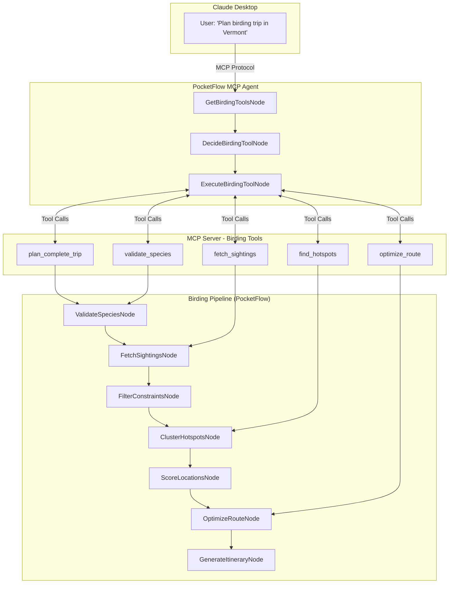

# Design Doc: Bird Travel Recommender

> Please DON'T remove notes for AI

## Requirements

> Notes for AI: Keep it simple and clear.
> If the requirements are abstract, write concrete user stories

### Core Problem Statement
Given a list of target bird species and travel constraints, generate an optimal route that maximizes observation probability while minimizing travel time. The solution must be accessible through natural language conversation in Claude Desktop via Model Context Protocol (MCP).

### User Stories
1. **Fall Migration Enthusiast**: "I want to see 5 specific warblers during fall migration in New England over a 3-day weekend"
2. **Winter Birding Trip**: "Plan a weekend trip from Boston to see winter waterfowl within 2 hours drive"
3. **Photography Focus**: "Find the best spots for photographing raptors within my region, ordered by recent activity"
4. **Quick Lookup**: "Show me recent cardinal sightings near Boston"
5. **Hotspot Discovery**: "What are the best birding locations within 50km of Hartford, CT?"

### Success Criteria
- Generate routes that include recent sighting data from eBird
- Optimize travel distance while maximizing species diversity
- Provide actionable itinerary with GPS coordinates and hotspot details
- Handle edge cases (rare species, no recent sightings)
- **Accessible via natural language in Claude Desktop through MCP**
- **Modular tools for both complete planning and individual queries**
- **Toggle between local development and MCP deployment modes**

## Flow Design

> Notes for AI:
> 1. Consider the design patterns of agent, map-reduce, rag, and workflow. Apply them if they fit.
> 2. Present a concise, high-level description of the workflow.

### Applicable Design Pattern:

**Primary**: Agent (PocketFlow 3-node MCP agent pattern)
**Secondary**: Workflow (birding pipeline nodes exposed as MCP tools)
**Tertiary**: Map-Reduce (fetch sightings for multiple species in parallel)

### Dual Architecture Design:

#### 1. MCP Agent Layer (User Interface)
Following PocketFlow's MCP cookbook pattern:
1. **GetBirdingToolsNode**: Discover available birding tools from MCP server
2. **DecideBirdingToolNode**: Use LLM to select appropriate tool based on user query
3. **ExecuteBirdingToolNode**: Execute selected tool and return formatted results

#### 2. Birding Pipeline Layer (Business Logic)
Core birding workflow exposed as MCP tools:
1. **ValidateSpeciesNode**: Validate bird species names against eBird taxonomy
2. **FetchSightingsNode**: Query eBird API for recent sightings (BatchNode for parallel processing)
3. **FilterConstraintsNode**: Apply user constraints (region, dates, distance)
4. **ClusterHotspotsNode**: Group nearby locations to minimize travel
5. **ScoreLocationsNode**: Rank locations by species diversity and sighting frequency
6. **OptimizeRouteNode**: Calculate optimal visiting order using TSP-style algorithm
7. **GenerateItineraryNode**: Format final markdown itinerary with maps and details



### Implementation Modes

**Development Mode** (`USE_MCP = False`):
- Direct execution of birding pipeline for testing
- Local debugging and development
- Fast iteration on node logic

**Production Mode** (`USE_MCP = True`):
- MCP server exposes tools to Claude Desktop
- Agent pattern handles natural language queries
- Modular tool execution based on user intent

## Utility Functions

> Notes for AI:
> 1. Understand the utility function definition thoroughly by reviewing the doc.
> 2. Include only the necessary utility functions, based on nodes in the flow.

### Core Birding Utilities

1. **Call LLM** (`utils/call_llm.py`)
   - *Input*: prompt (str)
   - *Output*: response (str)
   - Used by ValidateSpeciesNode, DecideBirdingToolNode, and GenerateItineraryNode

2. **eBird API Client** (`utils/ebird_api.py`)
   - *Input*: species_code (str), region (str), days_back (int)
   - *Output*: list of sighting records with GPS coordinates
   - Used by FetchSightingsNode to query recent bird observations

3. **Location Distance Calculator** (`utils/geo_utils.py`)
   - *Input*: lat1, lng1, lat2, lng2 (float)
   - *Output*: distance in kilometers (float)
   - Used by ClusterHotspotsNode and OptimizeRouteNode for spatial calculations

4. **Route Optimizer** (`utils/route_optimizer.py`)
   - *Input*: start_location, locations_list
   - *Output*: optimized route with distances
   - Used by OptimizeRouteNode for TSP-style route planning

### MCP Integration Utilities

5. **MCP Tool Registry** (`utils/mcp_tools.py`)
   - *Input*: tool definitions and metadata
   - *Output*: available tools list for discovery
   - Used by GetBirdingToolsNode to enumerate available birding functions

6. **MCP Client Interface** (`utils/mcp_client.py`)
   - *Input*: tool_name (str), parameters (dict)
   - *Output*: tool execution results
   - Used by ExecuteBirdingToolNode to call MCP server tools

7. **Mode Toggle** (`utils/config.py`)
   - *Input*: USE_MCP boolean flag
   - *Output*: execution mode configuration
   - Used throughout application to switch between local and MCP execution

## Node Design

### Shared Store

> Notes for AI: Try to minimize data redundancy

#### MCP Agent Shared Store (for natural language interface):

```python
agent_shared = {
    "user_query": "Plan a birding trip in Vermont for warblers",
    "available_tools": [],         # List of MCP tools discovered
    "selected_tool": "",           # Tool chosen by DecideBirdingToolNode
    "tool_parameters": {},         # Extracted parameters for tool execution
    "tool_result": "",             # Final result from ExecuteBirdingToolNode
    "conversation_context": []     # Previous queries/results for context
}
```

#### Birding Pipeline Shared Store (for business logic):

```python
birding_shared = {
    "input": {
        "species_list": ["Northern Cardinal", "Blue Jay"],
        "constraints": {
            "start_location": {"lat": 42.3601, "lng": -71.0589},
            "max_days": 3,
            "max_daily_distance_km": 200,
            "date_range": {"start": "2024-09-01", "end": "2024-09-30"},
            "region": "US-MA"
        }
    },
    "validated_species": [],        # eBird codes and common names
    "all_sightings": {},           # Raw API responses by species
    "filtered_sightings": [],      # After applying constraints
    "hotspot_clusters": [],        # Grouped nearby locations
    "scored_locations": [],        # Ranked by species diversity
    "optimized_route": [],         # Final visiting order
    "itinerary_markdown": "",      # Generated output
    "processing_stats": {},        # Debugging metadata
    "execution_mode": "mcp"        # "local" or "mcp"
}
```

### Node Steps

> Notes for AI: Carefully decide whether to use Batch/Async Node/Flow.

#### MCP Agent Nodes (Natural Language Interface)

1. **GetBirdingToolsNode**
   - *Purpose*: Discover available birding tools from MCP server
   - *Type*: Regular Node
   - *Steps*:
     - *prep*: Read user_query from agent_shared
     - *exec*: Query MCP server for available birding tools and their schemas
     - *post*: Write available_tools list to agent_shared

2. **DecideBirdingToolNode**
   - *Purpose*: Analyze user query and select appropriate birding tool
   - *Type*: Regular Node
   - *Steps*:
     - *prep*: Read user_query and available_tools from agent_shared
     - *exec*: Use LLM to parse intent and select best tool with parameters
     - *post*: Write selected_tool and tool_parameters to agent_shared

3. **ExecuteBirdingToolNode**
   - *Purpose*: Execute selected tool via MCP and format results
   - *Type*: Regular Node
   - *Steps*:
     - *prep*: Read selected_tool and tool_parameters from agent_shared
     - *exec*: Call MCP client to execute tool with parameters
     - *post*: Write tool_result to agent_shared and return formatted response

#### Birding Pipeline Nodes (Business Logic)

4. **ValidateSpeciesNode**
   - *Purpose*: Convert common bird names to eBird species codes and validate
   - *Type*: Regular Node
   - *Steps*:
     - *prep*: Read species_list from shared["input"]
     - *exec*: Call LLM to standardize names, then validate against eBird taxonomy
     - *post*: Write validated_species to shared store

2. **FetchSightingsNode**
   - *Purpose*: Query eBird API for recent sightings of each species
   - *Type*: BatchNode (parallel API calls for multiple species)
   - *Steps*:
     - *prep*: Return list of validated species codes
     - *exec*: Call eBird API for each species individually
     - *post*: Aggregate all sightings into shared["all_sightings"]

3. **FilterConstraintsNode**
   - *Purpose*: Apply user constraints (region, dates, distance) to sightings
   - *Type*: Regular Node
   - *Steps*:
     - *prep*: Read all_sightings and constraints from shared store
     - *exec*: Filter sightings by geographic and temporal constraints
     - *post*: Write filtered_sightings to shared store

4. **ClusterHotspotsNode**
   - *Purpose*: Group nearby locations to minimize travel between sites
   - *Type*: Regular Node
   - *Steps*:
     - *prep*: Read filtered_sightings and extract unique locations
     - *exec*: Use distance calculator to cluster nearby hotspots
     - *post*: Write hotspot_clusters to shared store

5. **ScoreLocationsNode**
   - *Purpose*: Rank clustered locations by species diversity and frequency
   - *Type*: Regular Node
   - *Steps*:
     - *prep*: Read hotspot_clusters from shared store
     - *exec*: Calculate scores based on species count and recent activity
     - *post*: Write scored_locations to shared store

6. **OptimizeRouteNode**
   - *Purpose*: Calculate optimal visiting order to minimize total travel distance
   - *Type*: Regular Node
   - *Steps*:
     - *prep*: Read scored_locations and start_location from shared store
     - *exec*: Use route optimizer utility for TSP-style optimization
     - *post*: Write optimized_route to shared store

10. **GenerateItineraryNode**
    - *Purpose*: Format final markdown itinerary with maps and metadata
    - *Type*: Regular Node
    - *Steps*:
      - *prep*: Read optimized_route and all metadata from shared store
      - *exec*: Call LLM to format professional itinerary with hotspot details
      - *post*: Write itinerary_markdown to shared store

## MCP Tools Specification

> Notes for AI: These tools are exposed via the MCP server and callable from Claude Desktop

### Tool Definitions

1. **plan_complete_trip**
   - *Description*: Generate a complete birding itinerary for target species
   - *Parameters*:
     - `species_list`: List[str] - Target bird species (common names)
     - `start_location`: dict - Starting point with lat/lng
     - `max_days`: int - Maximum trip duration
     - `max_daily_distance_km`: int - Daily travel limit
     - `region`: str - Geographic region code (e.g., "US-MA")
   - *Returns*: Complete markdown itinerary with route optimization
   - *Invokes*: Full 7-node birding pipeline

2. **validate_species**
   - *Description*: Validate and standardize bird species names
   - *Parameters*:
     - `species_list`: List[str] - Bird species to validate
   - *Returns*: List of validated species with eBird codes
   - *Invokes*: ValidateSpeciesNode only

3. **fetch_recent_sightings**
   - *Description*: Get recent sightings for specific species
   - *Parameters*:
     - `species_code`: str - eBird species code
     - `region`: str - Geographic region
     - `days_back`: int - Days to look back (default: 30)
   - *Returns*: List of recent sightings with locations
   - *Invokes*: FetchSightingsNode only

4. **find_birding_hotspots**
   - *Description*: Discover birding locations in an area
   - *Parameters*:
     - `location`: dict - Center point with lat/lng
     - `radius_km`: int - Search radius in kilometers
     - `species_filter`: List[str] - Optional species filter
   - *Returns*: Ranked list of hotspots with species diversity
   - *Invokes*: ClusterHotspotsNode + ScoreLocationsNode

5. **optimize_birding_route**
   - *Description*: Calculate optimal visiting order for locations
   - *Parameters*:
     - `locations`: List[dict] - Birding locations with coordinates
     - `start_point`: dict - Starting location
     - `constraints`: dict - Travel constraints
   - *Returns*: Optimized route with distances and timing
   - *Invokes*: OptimizeRouteNode only

### Tool Usage Examples

```
User: "Plan a 3-day birding trip from Boston to see fall warblers"
→ Calls: plan_complete_trip(species_list=["warbler species"], start_location={"lat": 42.3601, "lng": -71.0589}, max_days=3, region="US-MA")

User: "What are recent cardinal sightings near Hartford?"
→ Calls: fetch_recent_sightings(species_code="norcar", region="US-CT", days_back=7)

User: "Find the best birding spots within 50km of Albany"
→ Calls: find_birding_hotspots(location={"lat": 42.6526, "lng": -73.7562}, radius_km=50)
```

## Implementation Priority

> Notes for AI: Follow PocketFlow's iterative development approach

### Phase 1: Core Pipeline (Local Development)
1. Implement all 7 birding pipeline nodes
2. Create utility functions for eBird API and geospatial calculations
3. Test with local execution mode (`USE_MCP = False`)

### Phase 2: MCP Server
1. Create MCP server exposing 5 core tools
2. Implement tool routing to appropriate pipeline nodes
3. Test tool execution with MCP client

### Phase 3: MCP Agent
1. Implement 3-node agent pattern (Get → Decide → Execute)
2. Add natural language query parsing
3. Integrate with Claude Desktop

### Phase 4: Enhancement
1. Add conversation context and memory
2. Implement caching for API responses
3. Add advanced features (weather, migration timing, photography tips)