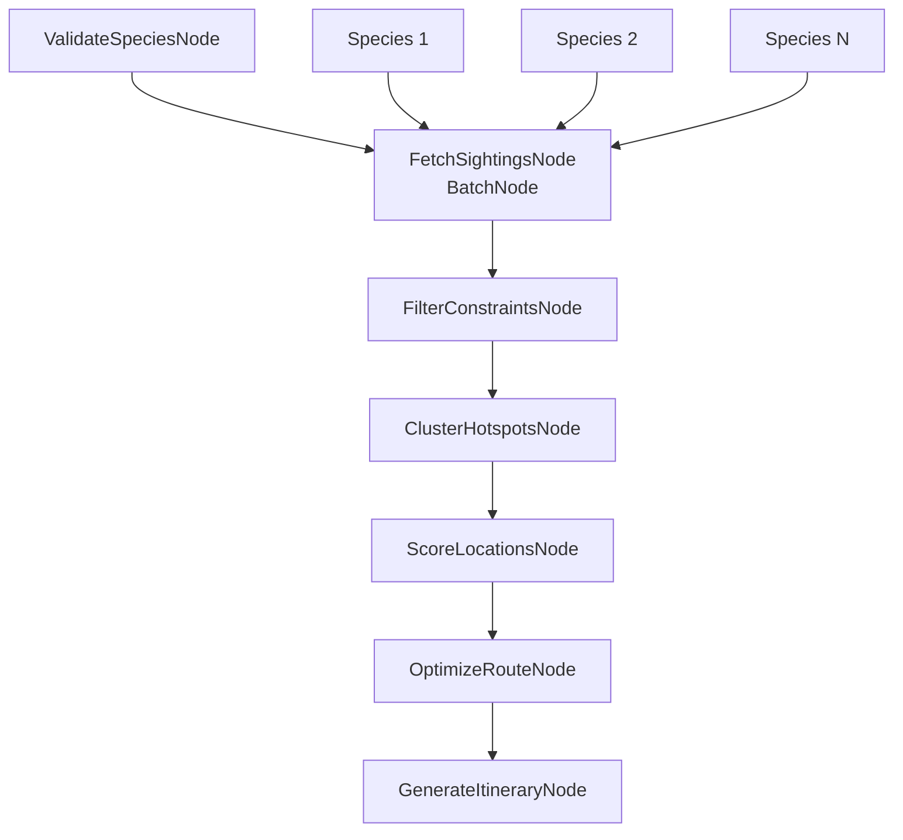

# Design Doc: Bird Travel Recommender

> Please DON'T remove notes for AI

## Requirements

> Notes for AI: Keep it simple and clear.
> If the requirements are abstract, write concrete user stories

### Core Problem Statement
Given a list of target bird species and travel constraints, generate an optimal route that maximizes observation probability while minimizing travel time.

### User Stories
1. **Fall Migration Enthusiast**: "I want to see 5 specific warblers during fall migration in New England over a 3-day weekend"
2. **Winter Birding Trip**: "Plan a weekend trip from Boston to see winter waterfowl within 2 hours drive"
3. **Photography Focus**: "Find the best spots for photographing raptors within my region, ordered by recent activity"

### Success Criteria
- Generate routes that include recent sighting data from eBird
- Optimize travel distance while maximizing species diversity
- Provide actionable itinerary with GPS coordinates and hotspot details
- Handle edge cases (rare species, no recent sightings)

## Flow Design

> Notes for AI:
> 1. Consider the design patterns of agent, map-reduce, rag, and workflow. Apply them if they fit.
> 2. Present a concise, high-level description of the workflow.

### Applicable Design Pattern:

**Primary**: Workflow (sequential task decomposition)
**Secondary**: Map-Reduce (fetch sightings for multiple species in parallel, then reduce to clustered locations)

### Flow high-level Design:

1. **ValidateSpeciesNode**: Validate bird species names against eBird taxonomy
2. **FetchSightingsNode**: Query eBird API for recent sightings (BatchNode for parallel processing)
3. **FilterConstraintsNode**: Apply user constraints (region, dates, distance)
4. **ClusterHotspotsNode**: Group nearby locations to minimize travel
5. **ScoreLocationsNode**: Rank locations by species diversity and sighting frequency
6. **OptimizeRouteNode**: Calculate optimal visiting order using TSP-style algorithm
7. **GenerateItineraryNode**: Format final markdown itinerary with maps and details



## Utility Functions

> Notes for AI:
> 1. Understand the utility function definition thoroughly by reviewing the doc.
> 2. Include only the necessary utility functions, based on nodes in the flow.

1. **Call LLM** (`utils/call_llm.py`)
   - *Input*: prompt (str)
   - *Output*: response (str)
   - Used by ValidateSpeciesNode for species name validation and GenerateItineraryNode for formatting

2. **eBird API Client** (`utils/ebird_api.py`)
   - *Input*: species_code (str), region (str), days_back (int)
   - *Output*: list of sighting records with GPS coordinates
   - Used by FetchSightingsNode to query recent bird observations

3. **Location Distance Calculator** (`utils/geo_utils.py`)
   - *Input*: lat1, lng1, lat2, lng2 (float)
   - *Output*: distance in kilometers (float)
   - Used by ClusterHotspotsNode and OptimizeRouteNode for spatial calculations

4. **Route Optimizer** (`utils/route_optimizer.py`)
   - *Input*: start_location, locations_list
   - *Output*: optimized route with distances
   - Used by OptimizeRouteNode for TSP-style route planning

## Node Design

### Shared Store

> Notes for AI: Try to minimize data redundancy

The shared store structure is organized as follows:

```python
shared = {
    "input": {
        "species_list": ["Northern Cardinal", "Blue Jay"],
        "constraints": {
            "start_location": {"lat": 42.3601, "lng": -71.0589},
            "max_days": 3,
            "max_daily_distance_km": 200,
            "date_range": {"start": "2024-09-01", "end": "2024-09-30"},
            "region": "US-MA"
        }
    },
    "validated_species": [],        # eBird codes and common names
    "all_sightings": {},           # Raw API responses by species
    "filtered_sightings": [],      # After applying constraints
    "hotspot_clusters": [],        # Grouped nearby locations
    "scored_locations": [],        # Ranked by species diversity
    "optimized_route": [],         # Final visiting order
    "itinerary_markdown": "",      # Generated output
    "processing_stats": {}         # Debugging metadata
}
```

### Node Steps

> Notes for AI: Carefully decide whether to use Batch/Async Node/Flow.

1. **ValidateSpeciesNode**
   - *Purpose*: Convert common bird names to eBird species codes and validate
   - *Type*: Regular Node
   - *Steps*:
     - *prep*: Read species_list from shared["input"]
     - *exec*: Call LLM to standardize names, then validate against eBird taxonomy
     - *post*: Write validated_species to shared store

2. **FetchSightingsNode**
   - *Purpose*: Query eBird API for recent sightings of each species
   - *Type*: BatchNode (parallel API calls for multiple species)
   - *Steps*:
     - *prep*: Return list of validated species codes
     - *exec*: Call eBird API for each species individually
     - *post*: Aggregate all sightings into shared["all_sightings"]

3. **FilterConstraintsNode**
   - *Purpose*: Apply user constraints (region, dates, distance) to sightings
   - *Type*: Regular Node
   - *Steps*:
     - *prep*: Read all_sightings and constraints from shared store
     - *exec*: Filter sightings by geographic and temporal constraints
     - *post*: Write filtered_sightings to shared store

4. **ClusterHotspotsNode**
   - *Purpose*: Group nearby locations to minimize travel between sites
   - *Type*: Regular Node
   - *Steps*:
     - *prep*: Read filtered_sightings and extract unique locations
     - *exec*: Use distance calculator to cluster nearby hotspots
     - *post*: Write hotspot_clusters to shared store

5. **ScoreLocationsNode**
   - *Purpose*: Rank clustered locations by species diversity and frequency
   - *Type*: Regular Node
   - *Steps*:
     - *prep*: Read hotspot_clusters from shared store
     - *exec*: Calculate scores based on species count and recent activity
     - *post*: Write scored_locations to shared store

6. **OptimizeRouteNode**
   - *Purpose*: Calculate optimal visiting order to minimize total travel distance
   - *Type*: Regular Node
   - *Steps*:
     - *prep*: Read scored_locations and start_location from shared store
     - *exec*: Use route optimizer utility for TSP-style optimization
     - *post*: Write optimized_route to shared store

7. **GenerateItineraryNode**
   - *Purpose*: Format final markdown itinerary with maps and metadata
   - *Type*: Regular Node
   - *Steps*:
     - *prep*: Read optimized_route and all metadata from shared store
     - *exec*: Call LLM to format professional itinerary with hotspot details
     - *post*: Write itinerary_markdown to shared store