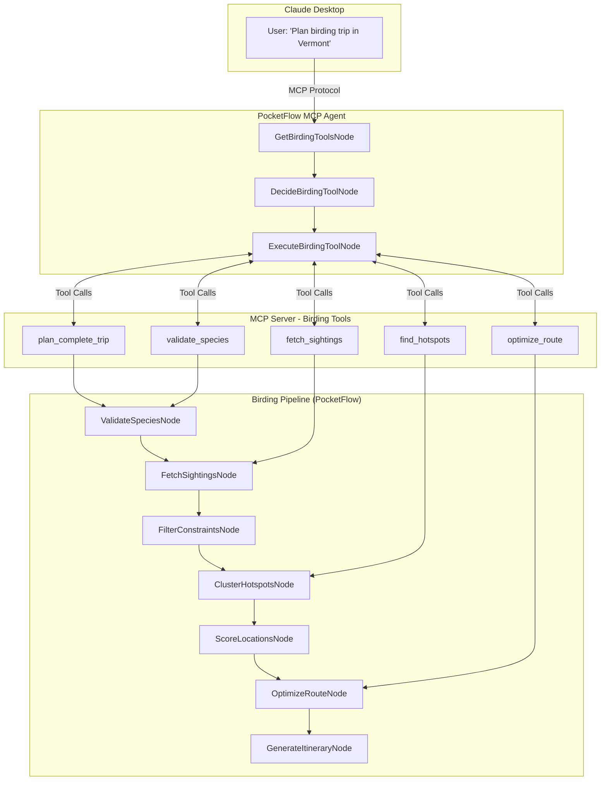

# Design Doc: Bird Travel Recommender

> Please DON'T remove notes for AI

## Requirements

> Notes for AI: Keep it simple and clear.
> If the requirements are abstract, write concrete user stories

### Core Problem Statement
Given a list of target bird species and travel constraints, generate an optimal route that maximizes observation probability while minimizing travel time. The solution must be accessible through natural language conversation in Claude Desktop via Model Context Protocol (MCP).

### User Stories
1. **Fall Migration Enthusiast**: "I want to see 5 specific warblers during fall migration in New England over a 3-day weekend"
2. **Winter Birding Trip**: "Plan a weekend trip from Boston to see winter waterfowl within 2 hours drive"
3. **Photography Focus**: "Find the best spots for photographing raptors within my region, ordered by recent activity"
4. **Quick Lookup**: "Show me recent cardinal sightings near Boston"
5. **Hotspot Discovery**: "What are the best birding locations within 50km of Hartford, CT?"

### Success Criteria
- Generate routes that include recent sighting data from eBird
- Optimize travel distance while maximizing species diversity
- Provide actionable itinerary with GPS coordinates and hotspot details
- Handle edge cases (rare species, no recent sightings)
- **Accessible via natural language in Claude Desktop through MCP**
- **Modular tools for both complete planning and individual queries**
- **Toggle between local development and MCP deployment modes**

## Flow Design

> Notes for AI:
> 1. Consider the design patterns of agent, map-reduce, rag, and workflow. Apply them if they fit.
> 2. Present a concise, high-level description of the workflow.

### Applicable Design Pattern:

**Primary**: Agent (PocketFlow 3-node MCP agent pattern)
**Secondary**: Workflow (birding pipeline nodes exposed as MCP tools)
**Tertiary**: Map-Reduce (fetch sightings for multiple species in parallel)

### Dual Architecture Design:

#### 1. MCP Agent Layer (User Interface)
Following PocketFlow's MCP cookbook pattern:
1. **GetBirdingToolsNode**: Discover available birding tools from MCP server
2. **DecideBirdingToolNode**: Use LLM to select appropriate tool based on user query
3. **ExecuteBirdingToolNode**: Execute selected tool and return formatted results

#### 2. Birding Pipeline Layer (Business Logic)
Core birding workflow exposed as MCP tools:
1. **ValidateSpeciesNode**: Validate bird species names against eBird taxonomy
2. **FetchSightingsNode**: Query eBird API for recent sightings (BatchNode for parallel processing)
3. **FilterConstraintsNode**: Apply user constraints (region, dates, distance)
4. **ClusterHotspotsNode**: Group nearby locations to minimize travel
5. **ScoreLocationsNode**: Rank locations by species diversity and sighting frequency
6. **OptimizeRouteNode**: Calculate optimal visiting order using TSP-style algorithm
7. **GenerateItineraryNode**: Format final markdown itinerary with maps and details



### Implementation Modes

**Development Mode** (`USE_MCP = False`):
- Direct execution of birding pipeline for testing
- Local debugging and development
- Fast iteration on node logic

**Production Mode** (`USE_MCP = True`):
- MCP server exposes tools to Claude Desktop
- Agent pattern handles natural language queries
- Modular tool execution based on user intent

## Utility Functions

> Notes for AI:
> 1. Understand the utility function definition thoroughly by reviewing the doc.
> 2. Include only the necessary utility functions, based on nodes in the flow.

### Core Birding Utilities

1. **Call LLM** (`utils/call_llm.py`)
   - *Input*: prompt (str)
   - *Output*: response (str)
   - Used by ValidateSpeciesNode, DecideBirdingToolNode, and GenerateItineraryNode

2. **eBird API Client** (`utils/ebird_api.py`)
   - *Primary Functions*:
     - `fetch_recent_observations(region_code, days_back, api_key)` → List[dict]
     - `fetch_species_sightings(species_code, region_code, days_back, api_key)` → List[dict]
     - `fetch_nearby_observations(lat, lng, distance_km, days_back, api_key)` → List[dict]
     - `lookup_species_taxonomy(species_codes, api_key)` → List[dict]
     - `get_regional_hotspots(region_code, api_key)` → List[dict]
   - *Authentication*: Uses EBIRD_API_KEY environment variable with X-eBirdApiToken header
   - *Error Handling*: Rate limiting, HTTP errors, empty results, invalid species/regions
   - *Response Format*: Standardized observation records with GPS coordinates and metadata
   - Used by ValidateSpeciesNode (taxonomy), FetchSightingsNode (observations), ClusterHotspotsNode (hotspots)

3. **Location Distance Calculator** (`utils/geo_utils.py`)
   - *Input*: lat1, lng1, lat2, lng2 (float)
   - *Output*: distance in kilometers (float)
   - Used by ClusterHotspotsNode and OptimizeRouteNode for spatial calculations

4. **Route Optimizer** (`utils/route_optimizer.py`)
   - *Input*: start_location, locations_list
   - *Output*: optimized route with distances
   - Used by OptimizeRouteNode for TSP-style route planning

### MCP Integration Utilities

5. **MCP Tool Registry** (`utils/mcp_tools.py`)
   - *Input*: tool definitions and metadata
   - *Output*: available tools list for discovery
   - Used by GetBirdingToolsNode to enumerate available birding functions

6. **MCP Client Interface** (`utils/mcp_client.py`)
   - *Input*: tool_name (str), parameters (dict)
   - *Output*: tool execution results
   - Used by ExecuteBirdingToolNode to call MCP server tools

7. **Mode Toggle** (`utils/config.py`)
   - *Input*: USE_MCP boolean flag
   - *Output*: execution mode configuration
   - Used throughout application to switch between local and MCP execution

## eBird API Integration Strategy

> Notes for AI: This section defines our approach to eBird API integration, including wrapper evaluation, implementation strategy, and specific technical details.

### API Research and Documentation

**Primary Sources:**
- Official eBird API 2.0 Documentation: https://documenter.getpostman.com/view/664302/S1ENwy59
- Digital Conservation Tutorial: `docs/Digital Conservation - eBird API Tutorial.md`
- Python Wrapper Analysis: https://github.com/ProjectBabbler/ebird-api

**Key Findings:**
- eBird API returns only the most recent observation per species per location (not comprehensive data)
- Observer bias: data concentrated where eBird users are active (cities, parks)
- Maximum 30-day historical lookback period
- Rate limits exist but are not clearly documented

### Implementation Approach: Hybrid Strategy (Option 3)

**Decision Rationale:**
- **Phase 1**: Use existing `ebird-api` wrapper patterns for rapid prototyping
- **Phase 2**: Extract and customize only needed functions into `utils/ebird_api.py`
- **Phase 3**: Own the code completely, no external dependency risk

**Operationalization:**
1. Fetch wrapper code from GitHub during implementation (not stored locally)
2. Adapt functions for specific pipeline node requirements
3. Write custom, focused functions in `utils/ebird_api.py`
4. Test with actual API key and project-specific data needs

### eBird API Technical Specifications

#### Authentication
```python
# Required header format
headers = {"X-eBirdApiToken": "YOUR_API_KEY"}

# Environment variable setup
EBIRD_API_KEY = "your_key_from_https://ebird.org/api/keygen"
```

#### Core Endpoints for Implementation

**1. Recent Observations in Region**
- **URL**: `/v2/data/obs/{regionCode}/recent`
- **Purpose**: Get most recent observation per species in region
- **Key Parameters**: `regionCode` (US-MA, CA-ON), `back` (days, max 30)
- **Used by**: General species discovery, ValidateSpeciesNode

**2. Recent Observations by Species**
- **URL**: `/v2/data/obs/{regionCode}/recent/{speciesCode}`
- **Purpose**: Get all recent locations for specific species
- **Used by**: FetchSightingsNode for detailed location data

**3. Nearby Observations**
- **URL**: `/v2/data/obs/geo/recent`
- **Parameters**: `lat`, `lng`, `dist` (max 50km)
- **Used by**: Location-based queries, ClusterHotspotsNode

**4. Species Taxonomy**
- **URL**: `/v2/ref/taxonomy/ebird`
- **Purpose**: Convert common names to eBird species codes
- **Used by**: ValidateSpeciesNode

**5. Regional Hotspots**
- **URL**: `/v2/ref/hotspot/{regionCode}`
- **Purpose**: Get known birding locations
- **Used by**: ClusterHotspotsNode, ScoreLocationsNode

#### Response Data Structure
```python
observation_record = {
    "speciesCode": "norcar",           # eBird species identifier
    "comName": "Northern Cardinal",    # Common name
    "sciName": "Cardinalis cardinalis", # Scientific name
    "locName": "Location Name",        # Human-readable location
    "obsDt": "2024-01-15 10:30",      # Observation datetime
    "howMany": 2,                     # Number of individuals
    "lat": 42.3601,                   # GPS latitude
    "lng": -71.0589,                  # GPS longitude
    "locId": "L12345"                 # eBird location identifier
}
```

### Implementation Details by Node

#### ValidateSpeciesNode Enhancements
- **LLM Integration**: Use call_llm to standardize common names to scientific names
- **eBird Taxonomy Lookup**: Convert scientific names to eBird species codes
- **Error Handling**: Manage cases where species are not found in eBird taxonomy
- **Caching**: Store successful name→code mappings to reduce API calls

```python
def validate_species_with_ebird(species_list, api_key):
    # 1. Standardize common names using LLM
    # 2. Look up species codes via eBird taxonomy API
    # 3. Return validated list with both names and codes
```

#### FetchSightingsNode Enhancements
- **Parallel Processing**: Use BatchNode to fetch multiple species simultaneously
- **Smart Querying**: Switch between region-wide and species-specific endpoints based on data needs
- **Response Aggregation**: Combine results from multiple API calls into unified format
- **Rate Limit Handling**: Implement exponential backoff for API throttling

```python
def fetch_species_sightings_batch(validated_species, region_code, days_back, api_key):
    # 1. Determine optimal endpoint strategy per species
    # 2. Execute parallel API calls with rate limiting
    # 3. Aggregate and normalize response data
    # 4. Handle empty results for rare species
```

#### FilterConstraintsNode Enhancements
- **Geographic Filtering**: Apply distance calculations from start_location
- **Temporal Filtering**: Filter by observation date within user's travel window
- **Data Quality Filtering**: Remove observations with missing GPS coordinates
- **Constraint Validation**: Ensure filtered results meet user's travel constraints

#### ClusterHotspotsNode Enhancements
- **Location Deduplication**: Handle eBird's multiple location identifiers for same GPS point
- **Distance-Based Clustering**: Group locations within reasonable travel distance
- **Hotspot Integration**: Merge observation locations with known eBird hotspots
- **Cluster Scoring**: Rank clusters by species diversity and accessibility

### Error Handling and Edge Cases

#### API-Specific Error Handling
- **HTTP 429 (Rate Limit)**: Exponential backoff with jitter
- **HTTP 404 (Invalid Species/Region)**: Graceful degradation with user feedback
- **HTTP 500 (Server Error)**: Retry with circuit breaker pattern
- **Empty Results**: Handle rare species with no recent observations

#### Data Quality Issues
- **Missing GPS Coordinates**: Filter out or estimate from location name
- **Duplicate Observations**: Deduplicate by locId + speciesCode + obsDt
- **Outdated Observations**: Validate observation dates within expected range
- **Invalid Species Codes**: Cross-reference with taxonomy before API calls

### Caching Strategy

#### Local Development Caching
- **API Response Caching**: Store successful responses for development/testing
- **Species Code Mapping**: Cache validated species name→code mappings
- **Hotspot Data**: Cache regional hotspot lists (low change frequency)

#### Production Considerations
- **Memory-Based Caching**: Redis or in-memory cache for frequent queries
- **Cache Invalidation**: Time-based expiry for observation data (24 hours)
- **Cache Keys**: Structured keys for easy invalidation (region:species:date)

### Performance Optimization

#### Batch Processing Strategy
- **Parallel API Calls**: Use BatchNode for multiple species queries
- **Request Batching**: Combine species codes in single taxonomy requests
- **Connection Pooling**: Reuse HTTP connections for multiple requests

#### Data Processing Optimization
- **Lazy Loading**: Load detailed data only when needed
- **Data Filtering**: Apply constraints early to reduce processing overhead
- **Memory Management**: Stream large result sets instead of loading entirely

### Testing Strategy

#### Unit Tests
- **Mock API Responses**: Test node logic without hitting live API
- **Error Condition Testing**: Verify handling of API failures
- **Data Validation**: Test species code validation and filtering logic

#### Integration Tests
- **Live API Testing**: Test with actual eBird API using test data
- **End-to-End Pipeline**: Validate full workflow with real user scenarios
- **Performance Testing**: Measure API response times and rate limits

#### Test Data Management
- **Sample Responses**: Store representative API responses for testing
- **Edge Case Data**: Include rare species, empty results, malformed data
- **Regional Variations**: Test with different geographic regions

## Node Design

### Shared Store

> Notes for AI: Try to minimize data redundancy

#### MCP Agent Shared Store (for natural language interface):

```python
agent_shared = {
    "user_query": "Plan a birding trip in Vermont for warblers",
    "available_tools": [],         # List of MCP tools discovered
    "selected_tool": "",           # Tool chosen by DecideBirdingToolNode
    "tool_parameters": {},         # Extracted parameters for tool execution
    "tool_result": "",             # Final result from ExecuteBirdingToolNode
    "conversation_context": []     # Previous queries/results for context
}
```

#### Birding Pipeline Shared Store (for business logic):

```python
birding_shared = {
    "input": {
        "species_list": ["Northern Cardinal", "Blue Jay"],
        "constraints": {
            "start_location": {"lat": 42.3601, "lng": -71.0589},
            "max_days": 3,
            "max_daily_distance_km": 200,
            "date_range": {"start": "2024-09-01", "end": "2024-09-30"},
            "region": "US-MA"
        }
    },
    "validated_species": [],        # eBird codes and common names
    "all_sightings": {},           # Raw API responses by species
    "filtered_sightings": [],      # After applying constraints
    "hotspot_clusters": [],        # Grouped nearby locations
    "scored_locations": [],        # Ranked by species diversity
    "optimized_route": [],         # Final visiting order
    "itinerary_markdown": "",      # Generated output
    "processing_stats": {},        # Debugging metadata
    "execution_mode": "mcp"        # "local" or "mcp"
}
```

### Node Steps

> Notes for AI: Carefully decide whether to use Batch/Async Node/Flow.

#### MCP Agent Nodes (Natural Language Interface)

1. **GetBirdingToolsNode**
   - *Purpose*: Discover available birding tools from MCP server
   - *Type*: Regular Node
   - *Steps*:
     - *prep*: Read user_query from agent_shared
     - *exec*: Query MCP server for available birding tools and their schemas
     - *post*: Write available_tools list to agent_shared

2. **DecideBirdingToolNode**
   - *Purpose*: Analyze user query and select appropriate birding tool
   - *Type*: Regular Node
   - *Steps*:
     - *prep*: Read user_query and available_tools from agent_shared
     - *exec*: Use LLM to parse intent and select best tool with parameters
     - *post*: Write selected_tool and tool_parameters to agent_shared

3. **ExecuteBirdingToolNode**
   - *Purpose*: Execute selected tool via MCP and format results
   - *Type*: Regular Node
   - *Steps*:
     - *prep*: Read selected_tool and tool_parameters from agent_shared
     - *exec*: Call MCP client to execute tool with parameters
     - *post*: Write tool_result to agent_shared and return formatted response

#### Birding Pipeline Nodes (Business Logic)

4. **ValidateSpeciesNode**
   - *Purpose*: Convert common bird names to eBird species codes and validate
   - *Type*: Regular Node
   - *eBird Integration*: Uses `lookup_species_taxonomy()` for species code validation
   - *Steps*:
     - *prep*: Read species_list from shared["input"]
     - *exec*: 
       1. Call LLM to standardize common names to scientific names
       2. Query eBird taxonomy API to get species codes
       3. Handle cases where species are not found in eBird database
       4. Cache successful name→code mappings for reuse
     - *post*: Write validated_species with both names and codes to shared store
   - *Error Handling*: Invalid species names, API failures, empty taxonomy results

2. **FetchSightingsNode**
   - *Purpose*: Query eBird API for recent sightings of each species
   - *Type*: BatchNode (parallel API calls for multiple species)
   - *eBird Integration*: Uses `fetch_species_sightings()` with intelligent endpoint selection
   - *Steps*:
     - *prep*: Return list of validated species codes from shared store
     - *exec*: 
       1. Determine optimal API strategy (region-wide vs species-specific)
       2. Execute parallel API calls with rate limiting and exponential backoff
       3. Handle empty results for rare species gracefully
       4. Normalize response data structure across different endpoints
     - *post*: Aggregate all sightings into shared["all_sightings"] with metadata
   - *Optimization*: Batch processing, connection pooling, response caching
   - *Error Handling*: Rate limits, API timeouts, invalid species codes, empty results

3. **FilterConstraintsNode**
   - *Purpose*: Apply user constraints (region, dates, distance) to sightings
   - *Type*: Regular Node
   - *eBird Integration*: Processes eBird observation data with GPS coordinates and timestamps
   - *Steps*:
     - *prep*: Read all_sightings and constraints from shared store
     - *exec*: 
       1. Geographic filtering using distance calculations from start_location
       2. Temporal filtering by observation date within user's travel window
       3. Data quality filtering (remove missing GPS coordinates)
       4. Apply max_daily_distance_km constraints for feasible travel
     - *post*: Write filtered_sightings with constraint compliance metadata to shared store
   - *Data Quality*: Handle eBird location inconsistencies, duplicate observations, outdated data

4. **ClusterHotspotsNode**
   - *Purpose*: Group nearby locations to minimize travel between sites
   - *Type*: Regular Node
   - *eBird Integration*: Uses `get_regional_hotspots()` and processes eBird location data
   - *Steps*:
     - *prep*: Read filtered_sightings and extract unique locations with locId/GPS data
     - *exec*: 
       1. Merge observation locations with known eBird hotspots
       2. Handle eBird's multiple location identifiers for same GPS coordinates
       3. Use distance calculator to cluster nearby locations (minimize travel time)
       4. Deduplicate locations based on proximity thresholds
     - *post*: Write hotspot_clusters with location metadata and accessibility scores
   - *Challenges*: eBird location ambiguity, GPS coordinate variations, hotspot data quality

5. **ScoreLocationsNode**
   - *Purpose*: Rank clustered locations by species diversity and frequency
   - *Type*: Regular Node
   - *eBird Integration*: Leverages eBird observation frequency and diversity metrics
   - *Steps*:
     - *prep*: Read hotspot_clusters from shared store
     - *exec*: 
       1. Calculate species diversity scores per cluster (target species found)
       2. Weight by observation recency and frequency (eBird activity levels)
       3. Factor in eBird hotspot popularity and accessibility ratings
       4. Apply user preference weights (photography, rarity, accessibility)
     - *post*: Write scored_locations with ranking rationale and confidence scores
   - *Scoring Factors*: Species count, observation recency, eBird hotspot status, user preferences

6. **OptimizeRouteNode**
   - *Purpose*: Calculate optimal visiting order to minimize total travel distance
   - *Type*: Regular Node
   - *Steps*:
     - *prep*: Read scored_locations and start_location from shared store
     - *exec*: Use route optimizer utility for TSP-style optimization
     - *post*: Write optimized_route to shared store

10. **GenerateItineraryNode**
    - *Purpose*: Format final markdown itinerary with maps and metadata
    - *Type*: Regular Node
    - *Steps*:
      - *prep*: Read optimized_route and all metadata from shared store
      - *exec*: Call LLM to format professional itinerary with hotspot details
      - *post*: Write itinerary_markdown to shared store

## MCP Tools Specification

> Notes for AI: These tools are exposed via the MCP server and callable from Claude Desktop

### Tool Definitions

1. **plan_complete_trip**
   - *Description*: Generate a complete birding itinerary for target species
   - *Parameters*:
     - `species_list`: List[str] - Target bird species (common names)
     - `start_location`: dict - Starting point with lat/lng
     - `max_days`: int - Maximum trip duration
     - `max_daily_distance_km`: int - Daily travel limit
     - `region`: str - Geographic region code (e.g., "US-MA")
   - *Returns*: Complete markdown itinerary with route optimization
   - *Invokes*: Full 7-node birding pipeline

2. **validate_species**
   - *Description*: Validate and standardize bird species names
   - *Parameters*:
     - `species_list`: List[str] - Bird species to validate
   - *Returns*: List of validated species with eBird codes
   - *Invokes*: ValidateSpeciesNode only

3. **fetch_recent_sightings**
   - *Description*: Get recent sightings for specific species
   - *Parameters*:
     - `species_code`: str - eBird species code
     - `region`: str - Geographic region
     - `days_back`: int - Days to look back (default: 30)
   - *Returns*: List of recent sightings with locations
   - *Invokes*: FetchSightingsNode only

4. **find_birding_hotspots**
   - *Description*: Discover birding locations in an area
   - *Parameters*:
     - `location`: dict - Center point with lat/lng
     - `radius_km`: int - Search radius in kilometers
     - `species_filter`: List[str] - Optional species filter
   - *Returns*: Ranked list of hotspots with species diversity
   - *Invokes*: ClusterHotspotsNode + ScoreLocationsNode

5. **optimize_birding_route**
   - *Description*: Calculate optimal visiting order for locations
   - *Parameters*:
     - `locations`: List[dict] - Birding locations with coordinates
     - `start_point`: dict - Starting location
     - `constraints`: dict - Travel constraints
   - *Returns*: Optimized route with distances and timing
   - *Invokes*: OptimizeRouteNode only

### Tool Usage Examples

```
User: "Plan a 3-day birding trip from Boston to see fall warblers"
→ Calls: plan_complete_trip(species_list=["warbler species"], start_location={"lat": 42.3601, "lng": -71.0589}, max_days=3, region="US-MA")

User: "What are recent cardinal sightings near Hartford?"
→ Calls: fetch_recent_sightings(species_code="norcar", region="US-CT", days_back=7)

User: "Find the best birding spots within 50km of Albany"
→ Calls: find_birding_hotspots(location={"lat": 42.6526, "lng": -73.7562}, radius_km=50)
```

## Implementation Priority

> Notes for AI: Follow PocketFlow's iterative development approach

### Phase 1: Core Pipeline (Local Development)
1. Implement all 7 birding pipeline nodes
2. Create utility functions for eBird API and geospatial calculations
3. Test with local execution mode (`USE_MCP = False`)

### Phase 2: MCP Server
1. Create MCP server exposing 5 core tools
2. Implement tool routing to appropriate pipeline nodes
3. Test tool execution with MCP client

### Phase 3: MCP Agent
1. Implement 3-node agent pattern (Get → Decide → Execute)
2. Add natural language query parsing
3. Integrate with Claude Desktop

### Phase 4: Enhancement
1. Add conversation context and memory
2. Implement caching for API responses
3. Add advanced features (weather, migration timing, photography tips)

## Implementation Roadmap with eBird Integration

> Notes for AI: This roadmap incorporates our eBird API integration strategy and follows the hybrid approach decision.

### Prerequisites
- **Environment Setup**: EBIRD_API_KEY configured in `.env`
- **Dependencies**: `uv add requests python-dotenv` (no external wrapper dependency)
- **API Access**: Verified eBird API key with basic endpoint testing

### Phase 1: eBird API Foundation (Local Development)

#### Step 1.1: Create Core eBird Utility (`utils/ebird_api.py`)
- **Reference Approach**: Fetch `ebird-api` wrapper code for pattern guidance
- **Implementation**: Extract and adapt core functions:
  - `fetch_recent_observations()` - region-wide species discovery
  - `fetch_species_sightings()` - species-specific location queries
  - `lookup_species_taxonomy()` - name validation and species codes
  - `get_regional_hotspots()` - known birding locations
- **Error Handling**: Rate limiting, HTTP errors, empty results
- **Testing**: Mock responses and live API validation

#### Step 1.2: Implement ValidateSpeciesNode
- **LLM Integration**: Use existing `call_llm()` for name standardization
- **eBird Validation**: Query taxonomy API for species codes
- **Caching Logic**: Store successful name→code mappings
- **Testing**: Invalid species, mixed input formats, API failures

#### Step 1.3: Implement FetchSightingsNode (BatchNode)
- **Parallel Processing**: Multiple species API calls with rate limiting
- **Smart Endpoint Selection**: Choose optimal API strategy per species
- **Response Aggregation**: Normalize data from different endpoints
- **Testing**: Rare species, empty results, API throttling

### Phase 2: Data Processing Pipeline (Local Development)

#### Step 2.1: Implement FilterConstraintsNode
- **Geographic Filtering**: Distance calculations from start location
- **Temporal Filtering**: Observation dates within travel window
- **Data Quality**: Remove invalid GPS coordinates, handle duplicates
- **Testing**: Edge cases, constraint validation, data integrity

#### Step 2.2: Implement ClusterHotspotsNode
- **Location Deduplication**: Handle eBird's location identifier variations
- **Hotspot Integration**: Merge observations with known hotspots
- **Distance-Based Clustering**: Group nearby locations for travel efficiency
- **Testing**: GPS accuracy, clustering algorithms, location conflicts

#### Step 2.3: Implement ScoreLocationsNode
- **Diversity Scoring**: Species count per location cluster
- **Recency Weighting**: Recent observations get higher scores
- **Hotspot Ratings**: Factor in eBird hotspot popularity
- **Testing**: Scoring algorithm accuracy, ranking consistency

### Phase 3: Complete Pipeline Testing (Local Development)

#### Step 3.1: End-to-End Pipeline Integration
- **Full Workflow**: Test complete 7-node pipeline with real data
- **Shared Store Validation**: Ensure data flows correctly between nodes
- **Error Propagation**: Verify graceful handling of node failures
- **Performance Measurement**: API call timing, memory usage, processing speed

#### Step 3.2: Real-World Scenario Testing
- **User Story Validation**: Test against defined user stories
- **Regional Variations**: Test with different geographic regions
- **Species Diversity**: Test with common and rare species combinations
- **Constraint Edge Cases**: Test travel distance limits, date ranges

### Phase 4: MCP Server Implementation

#### Step 4.1: MCP Tool Definitions
- **Tool Registry**: Define 5 MCP tools with proper schemas
- **Parameter Validation**: Ensure tool inputs match pipeline requirements
- **Response Formatting**: Standardize tool outputs for Claude Desktop
- **Testing**: Tool discovery, parameter parsing, execution routing

#### Step 4.2: MCP Agent Implementation
- **3-Node Agent Pattern**: GetBirdingToolsNode → DecideBirdingToolNode → ExecuteBirdingToolNode
- **Natural Language Processing**: LLM-based query parsing and tool selection
- **Context Management**: Handle conversation context and follow-up queries
- **Testing**: Query understanding, tool selection accuracy, response quality

### Phase 5: Production Deployment and Optimization

#### Step 5.1: Performance Optimization
- **Caching Strategy**: Implement response caching for development and production
- **Connection Pooling**: Optimize HTTP connections for API calls
- **Memory Management**: Handle large result sets efficiently
- **Monitoring**: Add logging and metrics for API usage and performance

#### Step 5.2: Enhanced Features
- **Conversation Memory**: Use graphiti MCP for user preference learning
- **Advanced Scoring**: Weather data, migration timing, photography tips
- **Error Recovery**: Robust handling of API outages and data inconsistencies
- **User Experience**: Improved natural language understanding and response formatting

### Development Guidelines

#### Code Quality Standards
- **Documentation**: Comprehensive docstrings for all eBird API functions
- **Type Hints**: Full type annotations for data structures and function signatures
- **Error Messages**: User-friendly error messages for common failure modes
- **Logging**: Structured logging for API calls, errors, and performance metrics

#### Testing Strategy
- **Unit Tests**: Mock eBird API responses for isolated node testing
- **Integration Tests**: Live API testing with rate limit respect
- **End-to-End Tests**: Complete user scenario validation
- **Performance Tests**: API response time and throughput measurement

#### Security Considerations
- **API Key Management**: Secure storage and rotation of eBird API keys
- **Rate Limit Compliance**: Respectful API usage within documented limits
- **Data Privacy**: No storage of sensitive location or user data
- **Error Disclosure**: Avoid exposing internal API details in error messages